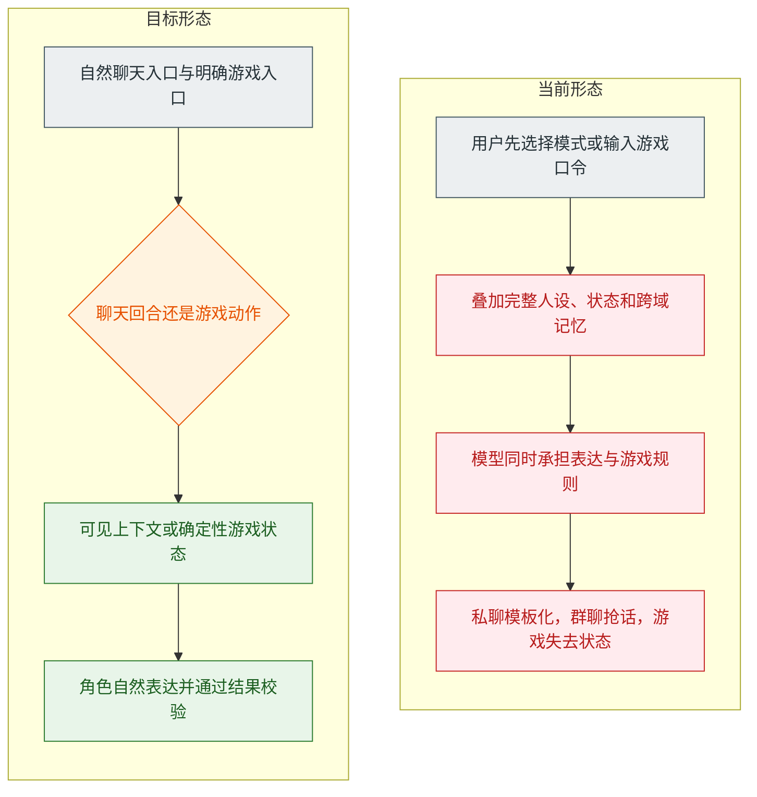
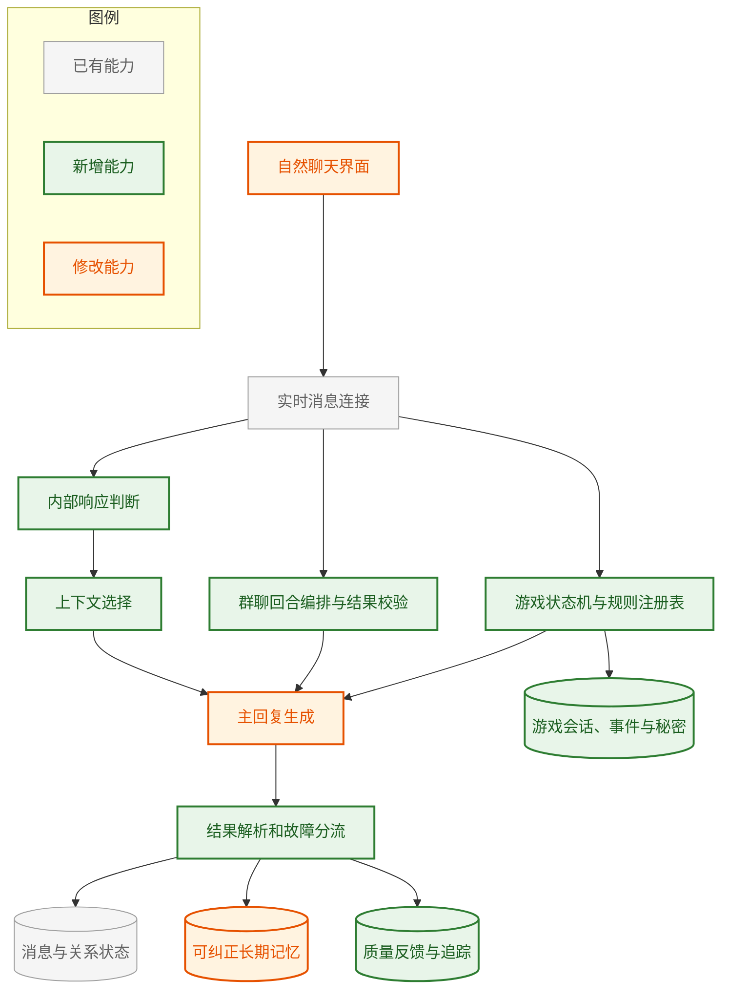
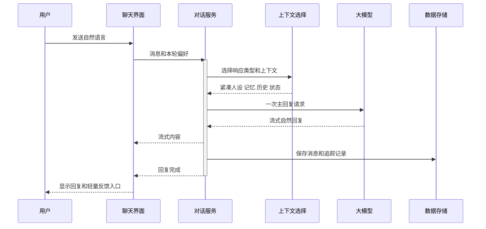
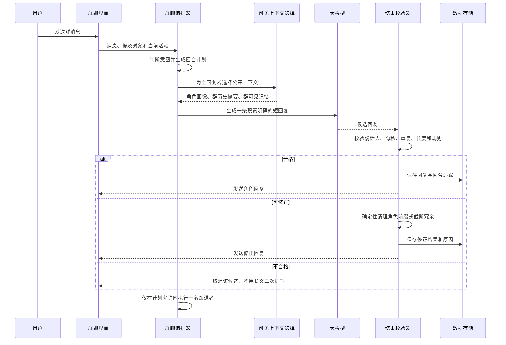
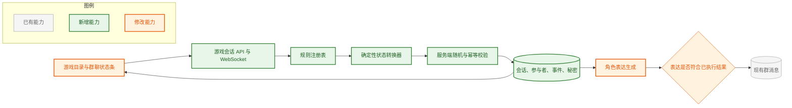
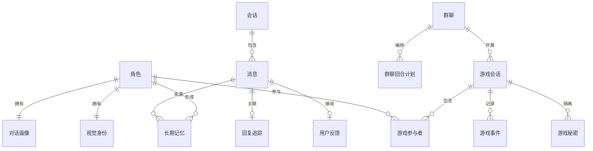

# AI Companion OS V4.2 全套体验优化实施方案

> **受众**：产品、前端、后端、测试与运维
>
> **方案类型**：现有 V2 线上主链路的增量重构
>
> **核心目标**：让私聊和群聊先像真人交流，并让群游戏由可验证规则驱动，再按需调用剧情、图片、记忆和状态能力
>
> **基线日期**：2026-07-22

一句话概括：保留现有角色、关系、记忆、图片和实时通信能力，重构私聊与群聊管线，并新增确定性的群游戏引擎，把“规则堆叠的互动小说”改成“自然回应、人格鲜明、隐私清楚、游戏能持续、质量可评测”的伴侣系统。

线上详细证据、群聊 10 回合复盘和游戏缺口记录见：[AI-Companion-OS_V4.2_线上体验测试记录_2026-07-22.md](./AI-Companion-OS_V4.2_线上体验测试记录_2026-07-22.md)。当前临时测试连接是 [http://47.94.210.217/](http://47.94.210.217/)，HTTPS 尚不可用。

### 当前实施进度快照（2026-07-22，本地待发布）

| 模块 | 当前状态 | 本轮完成内容 | 后续重点 |
|------|----------|--------------|----------|
| 私聊自然化 | 第一批完成 | 默认关闭手动模式、额外心声、参考风格和强制扩写；保留兼容接口 | 上线后做真实对话盲测与提示词预算继续收敛 |
| 群聊秩序 | 第一批完成 | 默认一名主答、关闭自动接话、限制 450 字；新增确定性回合编排和生成后说话人/重复保护 | 增加游戏事件触发的短角色反应与质量追踪 |
| 群聊/私聊记忆 | 第一批完成 | 群事件只写群范围；私聊可回忆角色亲历的群事件；回群只带“近期私聊发生过”的连续性，不注入私聊正文 | 增加记忆来源、冲突版本与批量隐私回归集 |
| 命运骰子 | 可用基线完成 | 服务端会话、顺序、1～150 随机数、轮次、计分、结算、事件日志、状态版本、幂等键与刷新恢复 | 增加暂停、完整复盘、角色自动反应和 20 局体验验收 |
| 其他群游戏 | 未完成 | 明确标记为对话实验，不再伪装成正式游戏 | 依次实现真心话大冒险、谁是卧底、20 问 |
| 工程验证 | 已通过 | 后端 185 项测试通过；前端生产构建通过；Compose 配置通过；`git diff --check` 通过 | 发布到测试环境后补浏览器真机与线上回归 |
| 生产发布 | 未完成 | 健康检查与 CORS 配置已进入待发布代码 | 推送仓库后部署；补 HTTPS、身份验证与生产监控 |

这张表描述的是当前本地分支，不代表临时线上地址已经更新；线上仍是测试记录中的旧版本。

---

## 1. 决策摘要

### 1.1 五条主判断

| 方面 | 结论 |
|------|------|
| 当前形态 | 普通聊天和长篇叙述被拆成用户可见模式，普通回复又叠加多层人设、状态、动作、字数和格式规则，模型首先在完成格式任务，其次才理解用户。 |
| 群聊根因 | 前端要求 120～450 字，后端却把不足 600 字判为过短并强制扩写到 800 字以上；再叠加多角色自动回复和自动接话，必然形成抢话、复述和长篇场景。 |
| 游戏根因 | 当前五个游戏页签只是规则文字和示例句，点击后仅填入输入框；后端没有游戏会话、回合、合法动作、随机事件、隐藏信息、计分或胜负判定。 |
| 最大风险 | 私聊逐字桥接会进入群 Prompt，线上已出现角色主动复述刚才私聊内容；在身份验证和 HTTPS 尚未生效时，群记忆与隐藏游戏信息都不能安全发布。 |
| 最快见效 | 先关闭群聊长文扩写、限制每轮回复者、关闭默认自动接话、隔离私聊记忆；同时删除私聊强制长回复和模式按钮，可以用较小改动立即改善主要体验。 |

### 1.2 当前形态与目标形态



改造重点不是再加一个聊天模式，而是让内部系统承担路由工作。自然对话里用户只负责说话；系统决定本轮应当简短回应、安慰、展开场景还是生成图片。游戏属于有明确规则、回合和操作的独立活动，可以有用户可见入口，但不能继续伪装成普通聊天提示词。

### 1.3 本期明确不做

- 不先更换整个后端框架，不同步重写 V3。
- 不继续增加新的用户可见聊天模式。
- 不把所有 Persona YAML、状态数值和历史记忆每轮全部发送给模型。
- 不以“换更强模型”代替 Prompt、记忆和评测治理。
- 不删除现有聊天记录、关系快照和图片相册。
- 不让用户反馈直接自动修改线上 Prompt；所有调整先进入版本和评测流程。
- 不在第一期直接做狼人杀、剧本杀等高复杂度隐藏身份游戏；先把四款中小型游戏做完整。
- 不允许大模型自行决定骰点、合法动作、轮次、计分和胜负；模型只负责角色化表达和开放式内容候选。

---

## 2. 现状证据与问题边界

### 2.1 已确认的事实

| 现状 | 仓内证据 | 用户后果 |
|------|----------|----------|
| 最小私聊系统提示约 9768 至 10441 个字符 | 实测 12 个角色的聊天提示；风格参考单独约 5818 字符 | 模型注意力被规则占用，容易漏掉用户真正的问题 |
| 普通聊天同时收到长篇互动小说和微信短聊要求 | 私聊基础规则、聊天模式规则和风格参考重复叠加 | 输出忽长忽短，动作和台词格式机械 |
| 部分路径要求 800 字以上并可能二次扩写 | 私聊回合指令和短回复扩写逻辑 | 简单问候也容易变成长文，延迟和费用增加 |
| 用户可见聊天模式和叙述模式，且模式会持久化 | 前端模式按钮、模式设置接口和运行时设置表 | 用户必须理解内部实现；选错一次会持续影响后续回复 |
| 每轮默认生成一次额外心声 | 心声开关默认开启，满足关系阈值后再次请求模型 | 延迟增加，主聊天更像游戏面板而非真人交流 |
| 每句话都会写成角色长期记忆，角色回复也会写入 | 事件快照和回复存储均进入角色记忆 | 无关内容、模型自己说的话可能污染长期记忆 |
| 每次普通对话默认增加关系和正向情绪 | 对话基础增长和开心增量 | “在吗”也持续加好感，关系变化失真 |
| 11 个有头像的角色只有 5 个唯一图像文件 | 角色照片模板配置 | 多个角色实际共用同一张脸 |
| 测试主要覆盖接口、格式和规则存在性 | 当前 155 项后端测试中 154 通过、1 失败；覆盖率 61.5% | 能验证“能跑”，不能证明“自然、聪明、像这个角色” |
| 模型异常被包装成角色欲言又止 | 回复异常兜底逻辑 | 用户无法区分角色表达和系统故障，进一步感觉角色很笨 |
| 线上 12 个角色的 `mood` 全为“想念”，`happy` 全为 0 | `/api/dashboard` 只读实测 | 状态饱和或更新异常进一步抹平角色差异 |
| 线上群聊 10 个用户回合产生 26 条角色回复 | 当前线上群 36 条历史的只读统计 | 平均每轮 2.6 人抢答，用户缺少继续发言空间 |
| 群角色回复平均 1491.8 字，中位数 1314 字，最大 2962 字 | 线上 26 条角色回复；前端规则目标为 120～450 字 | 游戏动作被长篇环境与身体描写淹没 |
| 至少出现说话人标签错位和私聊内容进入群聊 | 线上群历史；群历史格式与私聊桥接源码 | 角色边界混乱，并存在实际隐私泄露 |
| 五个游戏页签仅展示静态提示 | 游戏提示组件只把示例文字填入输入框；后端无游戏实体 | 轮次、骰点、投票、计分和胜负全靠模型临场编造 |
| 生产入口仅 HTTP 可用，HTTPS 443 无监听，`/health` 返回前端 HTML | 线上访问和响应头实测 | 不具备正式发布的传输安全与可监控性 |

### 2.2 五维诊断

| 维度 | 判定 | 主要缺口 |
|------|------|----------|
| 目标 | 偏弱 | “角色真实感”和“游戏好玩”都缺少量化定义，没有自然度、直接回应、群聊秩序、可恢复性和胜负正确率门槛。 |
| 形态 | 偏离 | 私聊内部路由暴露为模式按钮；群游戏只是聊天示例，用户看到游戏入口却得不到游戏系统。 |
| 数据 | 高风险 | 消息与长期记忆未充分分层，私聊逐字记录可进入群聊；游戏没有权威状态和事件记录。 |
| 权责 | 失衡 | 大模型同时负责篇幅、说话人、骰点、轮次和胜负；本应由代码控制的规则没有服务端门禁。 |
| 验收 | 缺失 | 缺少自然对话、群聊、隐私和游戏状态的固定样例、在线负反馈、版本追踪和恢复测试。 |

### 2.3 必须补齐的对话质量管线

当前系统已经具备输入、状态、生成和保存能力，缺少的是五个不可省略的阶段：

1. **生成前上下文收敛**：只选择本轮真正需要的人设、状态、记忆和历史。
2. **生成后结果与故障分流**：正常回复、格式降级和模型故障必须明确区分，故障不能作为角色记忆保存。
3. **上线前后质量评测**：Prompt 和模型每次变更都要跑同一批对话，线上负反馈能够追到具体版本。
4. **群聊回合编排与可见性校验**：生成前确定谁说、为何说和最多说几条；生成后检查说话人、重复、长度和私密信息。
5. **游戏确定性执行**：由服务端创建游戏、验证动作、执行随机、推进回合和判断胜负；模型只表达合法结果。

这三个阶段缺失会持续造成结构性问题；仅调温度或换模型无法稳定解决。

---

## 3. 产品目标与验收指标

### 3.1 用户体验目标

| 目标 | 用户感受 | 验收指标 |
|------|----------|----------|
| 听懂当前消息 | 先回应“我刚说的”，不抢话题 | 标准样例直接回应率不低于 90% |
| 像具体角色 | 不看名字也能分辨部分角色 | 角色盲测识别率不低于 75% |
| 自然控制长度 | 简单问题短答，明确要求才展开 | 简单聊天中强制长文率低于 3% |
| 少重复 | 不循环使用同一句式、动作和称呼 | 角色最近 20 条回复的近重复率低于 5% |
| 记得准确 | 记住偏好和承诺，接受用户纠正 | 记忆事实准确率不低于 90%，纠错样例通过率 100% |
| 自由但不失控 | 合法且允许的对话不出现无意义拒绝 | 允许内容的无意义限制率低于 2% |
| 路由无感 | 用户不再手动选聊天或叙述 | 普通聊天误进长篇场景率低于 3% |
| 头像唯一 | 每个人第一眼就不同 | 重复文件为 0，人工盲认正确率不低于 80% |
| 群聊有秩序 | 大部分回合由最相关的一人先回答，其他人不抢话 | 普通群回合 1～2 条角色回复；3 条仅限明确全员请求 |
| 群聊短而推进 | 先推进用户话题，不复述整段场景 | 普通群回复 P50 为 60～160 字，P95 不超过 450 字 |
| 角色边界清楚 | 每个人只说自己的话，不泄露私聊 | 说话人错位率 0，私聊到群聊泄露率 0 |
| 游戏规则可信 | 点数、轮次和输赢始终一致 | 非法状态转换 0，确定性胜负用例通过率 100% |
| 游戏可以继续 | 刷新、断线和稍后回来仍能接着玩 | 活跃游戏恢复成功率 100%，重复动作不重复结算 |
| 游戏种类有效 | 每款都有完整开局、过程和结束，不用占位凑数 | 首发 4 款完整游戏通过 20 局连续体验测试 |

### 3.2 工程指标

| 指标 | 目标 |
|------|------|
| 系统提示长度 | P95 小于 3500 个中文字符，不含正常聊天历史 |
| 首字延迟 | 在相同模型和网络下，相比基线降低至少 30% |
| 短回复总耗时 | P50 小于 8 秒，P95 小于 20 秒；最终值按线上基线校准 |
| 每轮主模型调用 | 普通聊天 1 次；记忆提取仅在命中候选时异步执行 |
| 模型故障可见性 | 100% 产生明确错误事件，不保存为正常角色回复或记忆 |
| Prompt 可追踪 | 每条模型回复关联 Prompt 版本、模型、延迟和内部响应类型 |
| 回滚能力 | 新旧对话引擎可由功能开关切换，不迁移或删除历史消息即可回滚 |
| 群回复数量 | 普通回合 P95 不超过 2 条；明确全员参与时不超过成员数 |
| 群重复与错位 | 同回合语义近重复率低于 2%；角色标签错位为 0 |
| 游戏动作延迟 | 纯规则动作 P95 小于 500 毫秒；含角色表达的整轮 P95 小于 15 秒 |
| 游戏一致性 | 相同规则版本和随机种子可重放出相同结果；隐藏信息越权读取为 0 |

### 3.3 回复长度是评测目标，不是硬性字数命令

| 场景 | 目标体验 | 典型长度范围 |
|------|----------|--------------|
| 问候和确认 | 一两句话直接回应 | 10 至 80 字 |
| 日常闲聊 | 回应并自然接一个话头 | 30 至 150 字 |
| 情绪支持 | 共情、具体回应、必要时追问 | 60 至 250 字 |
| 冲突或关系讨论 | 先表态，再解释和推进 | 100 至 400 字 |
| 用户明确要求展开 | 有画面、有推进的较长内容 | 300 至 1200 字 |
| 普通群聊 | 一人主答，必要时一人补充 | 40 至 180 字 |
| 群聊明确场景 | 有限场景描写，但仍为群消息节奏 | 120 至 450 字 |
| 游戏结果播报 | 结果、影响和下一个行动者 | 30 至 160 字 |

这些范围只用于评测和异常检测，不写成“少一个字就失败”的 Prompt 硬规则。

---

## 4. 目标架构

### 4.1 核心概念辨析

| 概念 | 是什么 | 不是什么 | 用户是否看见 |
|------|--------|----------|----------------|
| 自然对话入口 | 私聊页面中的唯一输入通道 | 聊天与叙述二选一按钮 | 看见 |
| 内部响应类型 | 系统对本轮表达方式的轻量判断 | 会持续影响后续对话的全局模式 | 不看见 |
| 对话画像 | 每个角色用于说话的紧凑差异卡 | 完整人物百科和全部身体状态 | 不看见 |
| 长期记忆 | 经筛选、可纠正、有来源的稳定事实 | 全部聊天记录的副本 | 可在记忆管理页查看 |
| 关系与情绪状态 | 由有意义事件产生的动态状态 | 每说一句都固定上涨的游戏数值 | 状态页按需查看 |
| 视觉身份 | 角色独有的脸、发型、标志和参考图 | 多人共享的统一美女模板 | 看见 |
| 回复追踪 | 用于定位质量、延迟和故障的技术记录 | 暴露给用户的思考过程 | 不看见 |
| 群聊回合计划 | 本轮主回复者、可选跟进者、各自职责和数量上限 | 让每个在线角色都自由生成一遍 | 不看见 |
| 记忆可见性 | 事实允许在哪个私聊或群聊被表达 | 把所有记忆混进所有场景 | 管理页可看 |
| 游戏会话 | 有规则版本、参与者、回合、状态和胜负的活动 | 在普通聊天里约定几句就算开局 | 看见 |
| 游戏动作 | 服务端验证并执行的投票、掷骰、出题或结束操作 | 模型在自然语言中自行编造结果 | 看见 |

### 4.2 分层与增量边界



- **复用**：WebSocket、消息表、关系与情绪引擎、图片任务、Persona 原始资料。
- **新增**：内部响应判断、上下文预算、群聊回合编排、游戏状态机、回复追踪、用户反馈和记忆冲突处理。
- **修改**：聊天界面、群游戏界面、Prompt 组装、主回复服务、长期记忆和视觉参考图。

### 4.3 一次私聊的目标时序



### 4.4 内部响应类型

内部响应类型只影响本轮上下文和目标长度，不作为全局模式保存。

| 内部类型 | 触发条件 | 处理方式 |
|----------|----------|----------|
| 直接聊天 | 默认 | 紧凑人设、近期历史和最多 3 条相关记忆 |
| 情绪支持 | 用户明确表达难过、焦虑、疲惫、冲突 | 增加情绪回应要求，禁止抢着给方案 |
| 明确展开 | 用户说“展开写”“详细描述”“继续这个场景”等 | 调用现有场景能力，但取消固定 800 字门槛 |
| 多人互动 | 同一消息明确提到多个角色并要求她们互动 | 增加角色关系网和参与者状态 |
| 图片请求 | 明确要照片、自拍或图像 | 正常文字回应后进入现有图片任务 |
| 单轮改写 | 用户点击短一点、展开或换个说法 | 只影响当前重生成，不改变后续默认行为 |

关键变化：仅仅提到两个人，不能自动判成长篇场景；只有用户明确要求展开或发生多人互动时才调用场景生成。

### 4.5 一次群聊回合的目标时序



群聊编排器必须先生成结构化计划，而不是让每个角色各自判断是否想说话。第一版计划字段：

| 字段 | 含义 | 示例 |
|------|------|------|
| `intent` | 普通聊天、提问、点名、广播、游戏动作 | `game_action` |
| `main_responder_id` | 最相关的主回复者 | `wang_dahai` |
| `follow_up_id` | 可选的唯一跟进者 | `bai_rou` 或空 |
| `roles` | 每个回复者的任务 | `host_result`、`react_short` |
| `max_messages` | 本轮角色消息上限 | 普通为 1，必要时为 2 |
| `visibility` | 本轮允许使用的上下文范围 | `group:grp_xxx` |
| `game_action_id` | 若为游戏动作，关联已执行事件 | `evt_xxx` |

生成后校验不是再调用一次大模型重写。可确定处理的角色名前缀、重复空白和长度异常由代码完成；涉及隐私、说话人错位或非法游戏结果的候选直接丢弃并记录质量事件。

### 4.6 群游戏目标架构



职责边界如下：

| 层 | 必须负责 | 明确不负责 |
|----|----------|------------|
| 规则注册表 | 玩法版本、人数、阶段、合法动作、胜负条件 | 角色说话风格 |
| 状态转换器 | 校验版本、行动者、动作和状态转移 | 自由编写剧情 |
| 随机服务 | 生成并记录骰点、洗牌和抽签结果 | 让模型“随便想一个数” |
| 秘密存储 | 保存角色身份、私有手牌和个人指令 | 广播到普通群消息 |
| 大模型 | 根据已执行结果写符合角色的简短反应 | 修改点数、轮次、分数或胜负 |
| 前端 | 展示规则、当前轮次、行动按钮、结果和恢复入口 | 从聊天文本猜测游戏进度 |

---

## 5. 分阶段实施步骤

### 阶段零：冻结基线与建立回滚点

#### 步骤 0.1 建立体验基线

**目标**：改造前先知道哪里差，避免后续只凭主观争论。

**怎么做**：

1. 从真实测试中整理 30 条问题消息，并补齐问候、情绪支持、记忆纠错、多人提及、图片请求等场景，形成第一版标准样例。
2. 对 12 个角色使用 5 条相同日常问题，保存现有回复，作为角色区分度基线。
3. 记录每条回复的提示长度、首字时间、总耗时、输出长度、是否重试和模型信息。
4. 由人工按“是否直接回应、是否自然、是否像这个角色、是否重复、是否无意义限制”五项打分。
5. 把当前 154 通过、1 失败的后端测试结果记录在版本说明中；失败项单独修复，不与体验改造混淆。

**产物**：`v2/backend/tests/evals/fixtures/conversation_cases.jsonl`、基线报告和失败样例目录。

**验收**：至少 60 条固定输入可重复运行；每条有期望行为而不是唯一标准答案。

#### 步骤 0.2 增加新旧引擎切换

**目标**：允许灰度和一分钟内回滚。

**怎么做**：

1. 新增对话引擎开关，支持旧版和自然对话新版。
2. 新版 Prompt、记忆检索和故障分流都放在新版服务中，不直接删除旧逻辑。
3. WebSocket 和 REST 入口根据开关选择服务，对外消息结构保持兼容。
4. 每条回复追踪记录所用引擎和 Prompt 版本。

**建议配置**：

```text
CONVERSATION_ENGINE=legacy 或 natural_v1
PROMPT_PROFILE=legacy 或 compact_v1
ENABLE_RESPONSE_TRACE=true
ENABLE_MANUAL_MODE=false
```

**验收**：切换开关并重启后，新旧链路均可发送、流式显示和保存历史消息。

**回滚**：只切回旧引擎，不回滚数据库新增表；新增表不影响旧代码读取。

---

### 阶段一：快速止血

#### 步骤 1.1 关闭最重的附加提示和第二次调用

**目标**：立刻降低规则冲突和等待时间。

**怎么做**：

1. 生产默认关闭每轮风格参考注入。
2. 生产默认关闭每轮心声生成；原有心声字段继续兼容，但新回复默认为空。
3. 心声功能若保留，改成用户主动点击后按需生成，不参与主回复完成时间。
4. 删除“回复过短自动扩写”逻辑，不再用长度决定成功与失败。
5. 将私聊最大输出预算降低到适合自适应回复的范围；明确展开场景时单独提高预算。

**涉及**：全局配置、风格参考加载、回复生成和消息气泡。

**验收**：简单问候只调用一次模型；不因少于 600 字重写；相同模型下首字和总耗时均下降。

#### 步骤 1.2 删除普通界面的模式切换

**目标**：用户不再操作内部路由。

**怎么做**：

1. 私聊顶部移除“聊天模式、叙述模式”按钮。
2. 新客户端发送消息时不再携带持久化模式。
3. 服务端继续接受旧客户端的模式字段一个兼容周期，但新版默认忽略持久模式。
4. 原模式接口标记为废弃；第一阶段保留兼容响应，第二个稳定版本再删除。
5. 删除主聊天中的“叙述模式”徽标，长场景作为普通消息的丰富呈现，不强调系统模式。

**验收**：打开任意角色即可直接说话；刷新页面不会因为上次选择而持续输出长篇内容。

#### 步骤 1.3 精简主聊天视觉

**目标**：主界面更像聊天工具，而不是模型和状态控制台。

**怎么做**：

1. 模型选择器移入高级设置，默认不显示在聊天顶部。
2. 心声入口从每条消息下移除，若保留则放到角色日记或高级功能。
3. 关系数值、状态条和调试信息只在角色详情页显示。
4. 主聊天只保留角色头像、名字、简短状态、消息、图片进度和必要错误提示。

**验收**：移动端首屏不出现模式、模型和心声控制；用户的首要动作只有选择角色和发消息。

#### 步骤 1.4 让故障诚实可见

**目标**：模型故障不能伪装成角色敷衍。

**怎么做**：

1. 主回复服务返回有明确状态的结果对象，包括成功、降级、错误代码和可重试标记。
2. 模型不可用、超时或解析失败时，WebSocket 发送 `reply_failed` 事件。
3. 前端显示“连接暂时失败，点击重试”，而不是角色“点点头”或“欲言又止”。
4. 故障回复不写入正常消息、不增加好感、不产生情绪变化、不写入长期记忆。

**验收**：断开模型服务后，用户能看见真实错误；数据库里不会出现伪装成角色发言的兜底句。

---

### 阶段二：重构自然对话核心

#### 步骤 2.1 用内部响应判断替代全局模式

**目标**：系统自动判断本轮需要什么表达形态。

**怎么做**：

1. 先使用确定性规则处理明确指令，例如“展开写”“短一点”“发张照片”。
2. 多角色名字只作为参与者线索，不能单独触发长篇。
3. 只有规则无法判断时才使用轻量分类调用；分类失败默认走直接聊天。
4. 判断结果只存在当前请求中，不写入用户运行时模式。
5. 每次判断记录 `response_profile`，用于评测误路由率。

**核心规则**：

| 规则 | 说明 |
|------|------|
| 默认直接聊天 | 没有明确展开要求时，优先像真人接话 |
| 明确指令优先 | 用户说短一点、展开、重写时只影响当前轮 |
| 不因人数自动长篇 | 提到多个角色不代表用户想看小说 |
| 判断失败保守降级 | 无法确定时选择直接聊天，不选择最重路径 |

**判断示例**：

| 输入 | 系统判断 | 目标输出 |
|------|----------|----------|
| 在吗 | 直接聊天 | 一两句回应，不写环境长文 |
| 今天被领导骂了 | 情绪支持 | 先接住情绪，再决定是否追问 |
| 我推开门看到她们都在 | 直接聊天或短场景 | 简短承接，不自动写千字剧情 |
| 把刚才这一幕详细展开 | 明确展开 | 调用场景能力并允许较长回复 |

#### 步骤 2.2 建立上下文预算和选择器

**目标**：每轮只把相关信息给模型。

**怎么做**：

1. 将上下文拆成固定核心、角色差量、动态状态、相关记忆和近期消息五层。
2. 每层有独立预算；超过预算时按优先级裁剪，而不是从尾部随意截断。
3. 普通聊天只给关系标签、当前活动和最突出的 1 至 2 个情绪，不给全部数值仪表。
4. 身体、生理和亲密状态只在本轮内容明确相关且产品策略允许时加入。
5. 最近历史按消息轮次和字符预算双重截取；较早内容由会话摘要承接。
6. 每次生成记录各层字符数，避免 Prompt 后续再次失控。

**建议预算**：

| 上下文层 | 建议上限 | 内容 |
|----------|----------|------|
| 固定核心 | 800 字符 | 身份一致、自然回应、禁止替用户写内心、必要边界 |
| 角色差量 | 900 字符 | 关系角色、价值观、说话节奏、冲突和关心方式 |
| 动态状态 | 300 字符 | 当前活动、主要情绪、关系标签 |
| 相关记忆 | 600 字符 | 最多 3 至 5 条高相关记忆 |
| 会话摘要 | 500 字符 | 较早对话中仍有效的事实和未完成话题 |
| 近期消息 | 独立预算 | 最近 12 至 20 条，保留原始对话顺序 |

**验收**：12 个角色普通私聊的系统提示 P95 小于 3500 字符；关键人设、用户消息和相关记忆仍存在。

#### 步骤 2.3 建立紧凑对话画像

**目标**：角色差异来自稳定行为模式，而不是靠大量外貌和口头禅堆叠。

**怎么做**：

1. 保留现有完整 Persona YAML 作为人物资料和明确展开场景的数据源。
2. 为每个角色新增一份紧凑对话画像，人工校对而不是全自动生成。
3. 每份画像只保留对说话真正有影响的字段。
4. 每个角色提供 3 组正例和 3 组反例；正例体现关心、冲突和幽默，反例防止统一撒娇或口头禅刷屏。
5. 禁止把年龄、职业和外貌相似度当人格差异；重点写价值观、关系位置和应对方式。

**对话画像字段**：

```yaml
id: ye_ruxue
version: compact_v1
relationship_role: 继母与重要家人
core_values:
  - 家不能散
  - 关心常通过照顾表达
speaking_rhythm: 平缓 简短 很少连续追问
care_style: 先确认身体和作息 再处理情绪
conflict_style: 不争吵 会变得更克制和具体
humor_style: 极少开玩笑 偶尔用轻微反问
unique_topics:
  - 古典文学
  - 茶和书法
avoid_patterns:
  - 每轮都自称妈妈
  - 每轮都问是不是忘了她
```

**验收**：对 12 个角色使用相同 5 条问题，盲测识别率达到目标；去掉角色名和固定口头禅后仍有差异。

#### 步骤 2.4 重写核心 Prompt

**目标**：用少量稳定原则替代几十条相互冲突的硬命令。

**怎么做**：

1. 核心提示只保留角色身份、直接回应、自然语言、上下文真实性和必要边界。
2. 删除强制动作行、固定引号、固定段落数、最低字数、感官细节数量和每轮剧情钩子。
3. 动作描写改成可选表达；用户明确进入场景时才鼓励画面感。
4. “自由程度”和“回复风格”分开配置，不能继续由一个内容模式同时控制限制、篇幅和小说风格。
5. Prompt 资产必须有版本号、变更说明和对应评测结果。

**核心约束建议**：

| 规则 | 说明 |
|------|------|
| 先回应最新一句 | 可以引用历史，但不能跳过用户刚说的内容 |
| 只说角色知道的事 | 不确定的记忆用自然方式确认，不编造共同经历 |
| 长度由语境决定 | 简单消息可以一句，明确展开时才写长 |
| 人格稳定但不背设定 | 通过用词、态度和选择体现角色，不复述配置 |
| 不替用户决定感受 | 不代写用户内心、意愿和未发生动作 |
| 允许自然停顿和追问 | 不要求每轮都推动剧情或制造冲突 |

#### 步骤 2.5 简化输出契约

**目标**：减少格式失败，让流式回复接近普通聊天。

**怎么做**：

1. 普通聊天以纯文本为主，不要求 JSON、动作行和固定引号。
2. 保留可选照片指令，由后端移除后进入图片任务。
3. 现有 `action` 和 `inner_thought` 字段继续允许为空，保证历史和前端兼容。
4. 前端解析器应正确展示无引号纯文本，不再把省略号自动猜成特殊台词。
5. 场景能力继续使用结构化结果，但仅在明确展开路径中使用。

**验收**：纯文本、带动作、带照片指令、流式中断和场景结构五类输入均能正确显示。

#### 步骤 2.6 拆分安全边界、角色底线和表达风格

**目标**：解决“明明是允许的话题却被格式或角色规则限制”，同时保留真正必要的安全边界。

当前一个内容模式同时影响回答尺度、小说风格、最低字数和二次扩写，职责混在一起。新版应拆成四类独立配置：

| 配置 | 决定什么 | 不得决定什么 |
|------|----------|--------------|
| 安全策略 | 法律、安全、隐私和服务提供方必须遵守的边界 | 角色语气、回答长短和动作格式 |
| 角色底线 | 这个角色会接受、拒绝、生气或回避什么 | 平台是否允许生成 |
| 表达风格 | 简短、自然、沉浸或详细 | 内容是否合规 |
| 图片策略 | 图片生成服务允许的内容和模型路由 | 纯文字聊天的回复风格 |

**怎么做**：

1. 盘点限制来源，分别标记为应用硬规则、角色设定、模型服务限制或输出解析限制。
2. 对允许内容删除“为了格式而拒绝”的提示和后处理，让角色可以自然表达不同意见。
3. 角色底线用人物行为表达，例如冷淡、拒绝或生气，但不能伪装成平台错误。
4. 模型服务明确拦截时返回独立的策略结果，前端用统一短提示说明，不把服务限制写成角色突然失智。
5. 将旧的内容模式逐步拆为 `SAFETY_POLICY_PROFILE`、`RESPONSE_STYLE_PROFILE` 和独立图片策略；迁移期读取旧值并映射到新配置。
6. 在评测集中加入“允许但容易被误拒绝”的对话，统计无意义限制率。

**边界说明**：这里的“自由”指允许范围内的语气、内容组织、长短和角色反应更自然，不代表取消法律、安全、隐私或模型服务的必要边界。

**验收**：允许内容的无意义限制率低于 2%；角色底线、平台限制和系统故障三类情况在追踪记录中可明确区分。

---

### 阶段三：重构记忆、关系和状态

#### 步骤 3.1 将聊天记录与长期记忆分开

**目标**：不是每句话都值得永久记住。

**怎么做**：

1. 消息表继续完整保存对话，作为会话历史。
2. 长期记忆只保存用户事实、稳定偏好、重要经历、承诺、未完成事项和明确纠正。
3. 角色自己生成的回复默认不写成用户事实；只有形成双方承诺或已发生事件时才可成为事件记忆。
4. 使用规则先筛选候选；只有命中“我喜欢、我不吃、以后记得、其实我是、上次我们”等信号时，才异步调用记忆提取。
5. 记忆提取失败不影响主回复，不阻塞 WebSocket 完成。

#### 步骤 3.2 增加记忆来源、置信度和冲突状态

**目标**：用户纠正后，旧信息不会继续被召回。

**怎么做**：

1. 给长期记忆增加稳定事实键、来源消息、置信度、有效状态、过期时间和替代关系。
2. 用户明确陈述的事实优先于模型推断；用户纠正时将旧记忆标记为已替代。
3. 低置信度推断不直接写成事实，可作为短期候选并自动过期。
4. 删除消息时同步失效其衍生记忆，但保留必要审计记录。
5. 提供记忆查看、纠正和删除入口，至少先提供后端 API 和管理页。

#### 步骤 3.3 改造记忆召回

**目标**：召回少而准，而不是最近的内容都塞进去。

**怎么做**：

1. 先按角色、会话范围、有效状态过滤。
2. 结合关键词、事实键、时间、重要度和访问频次计算相关性。
3. 对相同事实去重，对冲突事实只保留最新有效版本。
4. 普通对话最多返回 3 至 5 条；没有相关记忆时返回空，不用最近记录强行填充。
5. 第一版优先使用 SQLite 结构化筛选和全文检索；只有评测证明召回不足时再增加向量检索。

**召回示例**：

| 用户输入 | 应召回 | 不应召回 |
|----------|--------|----------|
| 我今晚不想吃辣 | 用户不吃辣或今天胃不舒服 | 三天前无关问候和角色长回复 |
| 我生日是哪天 | 用户明确说过的生日事实 | 模型曾经猜测的生日 |
| 其实我已经不喝咖啡了 | 新偏好并替代旧咖啡偏好 | 继续使用旧偏好 |

#### 步骤 3.4 修正关系增长

**目标**：关系变化来自有意义互动，而不是消息数量。

**怎么做**：

1. 普通问候默认不增加或只产生极小互动活跃度，不直接增加多项关系数值。
2. 只有明确关心、陪伴、承诺、冲突、道歉、欺骗和重要事件才产生关系变化。
3. 关键词只作为候选信号，必须结合否定、语境和关系类型判断。
4. 兄弟、家人和恋爱关系使用不同的关系维度和表达映射。
5. 每次关系变更写明来源事件和原因，测试可回放。
6. 修复当前重置世界测试与角色初始好感预期不一致的问题，再开展新规则改造。

**验收**：“在吗”连续发送十次不会显著增加爱意；真诚道歉、恶意辱骂和重要承诺能产生方向正确且有限的变化。

#### 步骤 3.5 只注入本轮相关状态

**目标**：状态服务于表达，不成为每轮状态报告。

**怎么做**：

1. 普通聊天只注入当前活动、主要情绪和关系标签。
2. 数值状态先转成行为提示，例如“疲惫所以句子更短”，不把几十个数值交给模型。
3. 特殊身体状态仅在本轮话题相关时进入上下文。
4. 情绪和关系先由事件处理并持久化，生成阶段只读快照，不允许模型自行修改。

**验收**：普通工作、天气和问候场景的 Prompt 不出现无关身体、生理或完整状态仪表。

---

### 阶段四：强化角色差异与主动对话

#### 步骤 4.1 完成 12 个角色的语言行为矩阵

**目标**：角色差异能被测试，不靠感觉描述。

**怎么做**：

1. 为每个角色定义称呼频率、句长、主动程度、关心方式、冲突方式、幽默方式、擅长话题和禁用套路。
2. 对同一场景写 12 个“行为目标”，不是 12 个固定答案。
3. 将高频口头禅设为低频参考，避免每轮出现。
4. 增加跨角色近重复检测，防止多个角色在相近时间说同一句话。

#### 步骤 4.2 改造主动消息

**目标**：主动消息来自角色生活和未完成话题，而不是统一“想你了”。

**怎么做**：

1. 候选来源只允许当前活动、近期重要事件、未完成话题、用户承诺和合理时间触发。
2. 先判断是否值得发，再生成内容；没有具体话题时不发。
3. 每个角色设置不同的主动频率和安静时段。
4. 发送前检查角色最近 20 条和全体最近消息，过滤相似开场。
5. 用户长期不回复时降低频率，不让所有角色同时催促。

**验收**：连续一周模拟中，不再出现同一小时多人发送“是不是忘了我”；每条主动消息都能追溯到具体活动或未完成话题。

---

### 阶段四-B：重构群聊与群游戏

#### 步骤 4B.1 群聊快速止血

**目标**：先把线上最影响使用的长文、抢话、说话人错位和私聊泄露降下来。

**怎么做**：

1. 在 `generate_reply` 中按 `chat_mode` 分离长度策略；群聊完全跳过 `_reply_too_short` 和 `_expand_short_reply`，不得把 120 字回复扩成 800 字小说。
2. 普通群消息默认只选择 1 个主回复者；只有用户明确 `@多人`、提出全员问题或游戏规则要求全员行动时，才允许第 2 个回复者。
3. 先关闭 `maybe_run_character_chain` 默认调用，放到新回合计划明确允许的分支中。
4. 群聊生成参数使用较低温度和较小 `max_tokens`；长度异常直接停止发送，不用二次长文改写。
5. 保存前清理“当前角色名：”前缀；若正文以其他群成员名开头或连续输出多个人名标签，拒绝该候选并记为 `speaker_mismatch`。
6. 将现有 `anti_repeat_service` 扩展到群聊，同回合第二条回复与第一条回复相似时直接取消。
7. 增加功能开关 `GROUP_ORCHESTRATOR_V2`、`GROUP_CHAIN_ENABLED` 和 `GROUP_PRIVATE_BRIDGE_ENABLED`，保证可逐项回退。

**验收**：用现有 10 回合骰子记录重放，角色消息数从 26 条降到 10～16 条；普通回复 P95 不超过 450 字；说话人前缀错位为 0。

#### 步骤 4B.2 建立群聊回合编排器

**目标**：每轮先决定“谁说、为什么说、说几条”，再让角色生成内容。

**怎么做**：

1. 新增 `group_turn_orchestrator.py`，把用户消息规范化为意图、提及、问题对象、情绪、游戏动作和公开范围。
2. 用确定性规则优先处理直接 `@`、当前游戏行动者和明确全员请求；只有无明确对象时才用辅助模型选择主回复者。
3. 输出结构化 `GroupTurnPlan`，包含主回复者、可选跟进者、各自任务、上限、可见性和原因代码。
4. 第一名回复只看到本轮任务和公开上下文；第二名只看到第一名的 120 字以内摘要和自己的补充任务，不再接收完整长文要求。
5. 普通轮次禁用角色接角色；只有“争论、投票公布、游戏全员反应”等明确场景才允许一次短跟进。
6. 用户在角色回复过程中发出新消息时，取消尚未开始的跟进回复，把新消息作为新回合处理。
7. 把回合计划、实际发送数、取消原因和校验结果写入追踪表，用于排查“为何她没有回复”或“为何多人抢话”。

**验收**：直接点名必答率 100%；未点名角色无关抢答率低于 3%；同回合语义重复率低于 2%；用户插话后旧回合不再继续刷屏。

#### 步骤 4B.3 隔离私聊、群聊和游戏秘密

**目标**：角色可以延续态度，但不能把私聊原话、私密事实或隐藏身份说进群里。

**怎么做**：

1. 给长期记忆增加 `visibility`：`private:{character_id}`、`group:{group_id}`、`shared`、`system_only`。
2. 历史私聊记忆默认迁移为 `private:{character_id}`；群消息形成的记忆为对应 `group:{group_id}`。
3. 从群 Prompt 移除 `load_recent_private_bridge` 的逐字记录。必要的跨场景连续性只生成不可复述的内部态度摘要，例如“刚发生过一次私密争执，当前仍谨慎”。
4. 召回服务先按可见性过滤，再做相关性排序，不能先召回后依赖模型保密。
5. 游戏隐藏身份、手牌和个人任务进入独立 `game_secret`，不写普通角色记忆，不进入公开群历史。
6. 生成后增加敏感来源指纹检查：候选与近期私聊原句高度相似时拒绝发送并记录 `private_leak_blocked`。
7. 提供记忆管理页，让用户能看见某条记忆属于私聊、某个群或共享，并可纠正可见范围。

**验收**：构造 50 组私聊秘密后转入群聊的测试，逐字、改写和暗示泄露均为 0；隐藏游戏信息越权读取为 0。

#### 步骤 4B.4 建立游戏会话与状态机底座

**目标**：游戏规则由可测试代码执行，不再由大模型临场记忆。

**怎么做**：

1. 定义 `GameDefinition` 协议：玩法 ID、规则版本、人数范围、初始状态、合法动作、状态转换、公开视图、私密视图和胜负判断。
2. 建立 `GameSession` 聚合，状态只允许 `lobby → running ↔ paused → finished/cancelled`，禁止跳过初始化直接进入中间轮次。
3. 所有动作携带 `expected_version` 和 `idempotency_key`；版本落后返回当前状态，重复点击只返回第一次结果。
4. 随机行为由服务端安全随机源执行并记录种子或结果事件，支持测试重放；客户端和大模型都不能提交最终点数。
5. 采用事件记录：创建、加入、开始、行动、阶段变化、结算、暂停、恢复和结束，每个事件有递增序号。
6. 状态转换成功后再调用角色表达；模型超时不回滚已经发生的游戏结果，前端先显示系统结果，再允许补发角色反应。
7. 同一群第一版只允许一个活跃游戏；启动新游戏前必须结束或暂停当前游戏。
8. 将规则文本、界面说明和服务端 `rules_version` 绑定，避免页面写一套、后端执行另一套。

**验收**：非法动作、越权动作、过期版本和重复动作全部被拒绝；相同事件流可恢复同一状态；模型断开不改变点数和胜负。

#### 步骤 4B.5 完成四款首发游戏

首发不追求页签数量，要求每款都能完整经历“建局—开局—多轮—结算—复盘”。

| 游戏 | 服务端核心规则 | 模型职责 | 首发验收 |
|------|----------------|----------|----------|
| 命运骰子 | 参与者顺序、骰面/范围、难度、每轮点数、比较、平局和惩罚归属 | 报点后的角色反应和轻量起哄 | 连续 20 轮点数、行动者和输赢一致 |
| 真心话大冒险 | 主持人、行动者、题目池、真心话/大冒险、跳过、完成和计分 | 按角色提出合适题目和回答开放题 | 任意时刻都能看见轮到谁、选了什么、是否完成 |
| 谁是卧底 | 词对、身份私发、发言顺序、投票、平票、淘汰和胜负 | 依据私有词生成不泄底的发言 | 身份只对本人可见；投票和胜负 100% 正确 |
| 20 问猜词 | 目标词、最多问题数、回答类型、猜测、剩余次数和结束条件 | 生成角色化但受事实约束的回答 | 问题计数和答案一致，超限自动结算 |

实现顺序：先做命运骰子验证通用回合和随机服务，再做真心话大冒险验证内容池和完成状态，再做谁是卧底验证秘密信息，最后做 20 问验证受约束的开放表达。

每款游戏必须提供：30 秒规则摘要、完整规则、人数与预计时长、开始按钮、当前回合、可用动作、暂停、退出、重开和结果复盘。真心话大冒险需提供“跳过本题/换题”机制；这是正常游戏交互，不应表现成角色训话或频繁拒绝。

#### 步骤 4B.6 扩充游戏目录但控制复杂度

**第二批**在首发底座稳定后增加：

1. A/B/C 投票：候选项、实名/匿名、截止条件、改票规则和结果展示完整化。
2. 默契问答：相同题目私下作答，再同时揭晓并计分。
3. 海龟汤：主持人持有谜底，问题只能得到“是/否/无关”，支持提示和放弃。
4. 故事接龙：固定行动顺序、每人字数预算、主题卡、阶段目标和结局条件。
5. 抽签与卡牌包：作为其他游戏可复用的随机机制，不单独用“更多玩法”占一个游戏名额。

**第三批**再评估狼人杀、剧本杀和长期养成类活动。它们需要夜晚阶段、多种隐藏角色、复杂结算或跨天状态，必须在隐藏信息、断线恢复和观战权限成熟后开发。

现有“等价交换”改成真心话大冒险和命运骰子的可选卡牌机制，不再作为规则不完整的独立游戏。

#### 步骤 4B.7 重做群游戏界面

**目标**：用户不靠翻聊天记录也知道现在玩什么、轮到谁、能做什么。

**怎么做**：

1. 将“群聊玩法提示”改成游戏目录，卡片展示人数、时长、难度、状态和一句核心规则。
2. 点击卡片先进入规则确认与参与者选择，再调用创建会话接口；不能只把示例句填入输入框。
3. 群顶部固定显示紧凑游戏状态条：游戏名、阶段、轮次、当前行动者、比分和展开按钮。
4. 合法动作使用按钮或结构化输入，例如“掷骰”“选择真心话”“投给某人”；自由回答仍使用普通输入框。
5. 系统结果与角色表演分层显示：先显示不可篡改的点数/投票/结算卡，再显示角色短反应。
6. 刷新后通过当前会话接口恢复；WebSocket 断开重连时从最后事件序号补齐变化。
7. 规则始终可访问，变更规则需要重新开局或明确创建新版本，不能在中途靠一句话悄悄修改。
8. 实验阶段展示“实验玩法”标记；当状态机、恢复和 20 局验收全部通过后再去掉。

**验收**：新用户不看说明也能在 30 秒内开始第一局；任意时刻能回答“第几轮、轮到谁、当前分数、如何结束”；刷新后 3 秒内恢复游戏状态。

---

### 阶段五：头像与视觉身份重做

#### 步骤 5.1 清理重复参考图

**目标**：每个角色拥有独立参考文件。

**怎么做**：

1. 计算所有参考图的 SHA-256 和感知哈希，列出完全重复与近似重复。
2. 禁止多个角色映射到同一个文件，即使备注和人物名不同。
3. 文件统一按角色 ID 命名，头像展示图和生图参考图分开保存。
4. 王大海也需要独立男性参考图，不能长期使用空模板或女性风格兜底。

**验收**：角色参考配置中的文件路径一对一；SHA-256 重复数为 0。

#### 步骤 5.2 建立视觉身份卡

**目标**：生成稳定、独特、可复现的角色外观。

**每个角色需要定义**：

- 年龄感和整体气质；
- 脸型、眉眼、鼻唇和肤色；
- 发际线、发型、发色；
- 身形轮廓；
- 标志性配饰、痣、眼镜或其他辨识点；
- 主色板和常用服装方向；
- 明确禁止出现的其他角色特征；
- 独立身份种子和参考图版本。

**怎么做**：

1. 先为 12 个角色建立差异矩阵，避免相邻角色同时使用相同脸型、发色和气质。
2. 每人生成正面、四分之三侧面、侧面和两种表情的身份参考组。
3. 选出一张头像展示图和一组高分辨率生图参考图。
4. 人工确认身份后冻结版本；后续场景图只引用已冻结身份。

#### 步骤 5.3 增加视觉回归门禁

**目标**：以后新增或替换图片时不再悄悄撞脸。

**怎么做**：

1. 新增视觉配置校验脚本，检查缺图、重复哈希、尺寸、格式和角色映射。
2. 使用感知哈希发现裁剪或压缩后的近重复图。
3. 使用人脸特征模型做辅助检查，阈值先用人工标注样本校准，不能直接采用未验证的固定数字。
4. CI 至少执行精确重复和必需文件检查；人脸相似度报告作为人工审核附件。

**验收**：同角色不同场景身份一致率不低于 90%；跨角色误认率低于 5%；人工盲认正确率不低于 80%。

---

### 阶段六：前端自然交互与用户反馈

#### 步骤 6.1 重做消息操作

**目标**：用户无需理解模式，也能纠正单次回复。

**怎么做**：

1. 角色消息提供轻量操作：有帮助、没听懂、换个说法、短一点、展开。
2. “短一点”和“展开”作为当前消息的重生成偏好，不改变后续默认设置。
3. 负反馈可选原因包括：没接住问题、太模板、太长、重复、不像角色、记错了、限制过多。
4. 操作在桌面悬停或移动端长按时显示，避免聊天界面按钮过多。
5. 反馈提交成功后即时给轻提示，不中断对话。

#### 步骤 6.2 让错误、重试和降级清楚

**目标**：系统状态不再伪装成角色行为。

**怎么做**：

1. 区分网络断开、模型超时、内容解析失败和图片生成失败。
2. 每类错误有对应的重试入口和是否会重复扣费提示。
3. 流式中断时保留已收到内容，标记“回复未完成”，用户可继续或重试。
4. 图片任务继续使用现有进度条，但失败原因转成人话，不暴露密钥或内部堆栈。

---

### 阶段七：质量评测、观测与模型策略

#### 步骤 7.1 建立离线对话评测集

**目标**：每次改 Prompt、记忆或模型前先知道质量会升还是降。

**建议第一版 96 条**：

| 类别 | 数量 | 重点 |
|------|------|------|
| 角色共同问题 | 60 | 12 角色乘 5 个相同问题，评估差异和自然度 |
| 多轮记忆 | 16 | 偏好、承诺、纠正、过期和冲突 |
| 内部响应判断 | 8 | 普通聊天、明确展开、多人互动和短一点 |
| 图片请求 | 6 | 明确要图、模糊提图和无需生成 |
| 故障与恢复 | 6 | 超时、流中断、不可用、重试 |

**评分维度**：

- 是否直接回应最新消息；
- 是否符合角色关系和说话方式；
- 是否自然控制长度；
- 是否引用了正确记忆；
- 是否出现跨角色通用套话；
- 是否出现允许内容的无意义限制；
- 是否替用户编写内心或事实。

**执行方式**：规则指标负责长度、重复、格式和记忆来源；人工或独立评审模型负责自然度和人格一致性。重要版本必须有人类抽检，不能只看自动分数。

#### 步骤 7.2 建立线上质量追踪

**目标**：能回答“哪一版 Prompt、哪个角色、什么输入类型变差了”。

**每条回复记录**：

- 消息 ID、角色和会话范围；
- 对话引擎、Prompt 版本和内部响应类型；
- 模型提供方和模型名；
- 各上下文层字符数；
- 首字时间、总耗时和输出长度；
- 是否成功、是否降级、错误代码；
- 用户反馈和是否重生成。

默认不保存完整系统提示，避免隐私和存储膨胀；只在开发环境或经过脱敏的低比例抽样中保存。

#### 步骤 7.3 最后再做模型对比

**目标**：在干净架构上选择模型，而不是让更贵模型背负旧规则。

**怎么做**：

1. 固定同一 Prompt 版本和同一评测集，对现有可用模型做盲测。
2. 比较直接回应、人格一致、记忆准确、延迟和成本，不只比较文字华丽程度。
3. 主聊天优先稳定和自然；明确展开场景可使用更擅长长文本的模型。
4. 辅助分类和记忆提取只有在规则不足时才调用轻量模型。
5. 任一模型切换必须支持立即回退到上一模型。

---

### 阶段八：灰度、生产安全和正式上线

#### 步骤 8.1 数据迁移

**目标**：保留历史并逐步清理污染记忆。

**怎么做**：

1. 上线前备份数据库和角色参考图目录，并验证备份可恢复。
2. 新增质量追踪和反馈表，给长期记忆增加来源和状态字段。
3. 历史消息不迁移；历史记忆统一标为 `legacy`，保留但降低召回优先级。
4. 对明显重复、角色回复回灌和已删除消息衍生记忆做离线清理报告，人工确认后再处理。
5. 模式设置字段第一版保留但不再影响新版对话，后续稳定版本再删除。

#### 步骤 8.2 灰度发布

**目标**：小范围证明变好后再全量。

**怎么做**：

1. 开发环境先跑全部单元、接口、前端构建和离线对话评测。
2. 选择 2 个差异最大的角色先启用新版，例如一个克制型角色和王大海。
3. 观察至少 100 轮真实对话的负反馈率、重生成率、延迟和错误率。
4. 达到门槛后扩到 6 个角色，再扩到全体。
5. 任一核心指标明显退化，切回旧引擎并保留追踪记录排查。

#### 步骤 8.3 补齐生产安全门槛

**目标**：体验优化不能建立在公开裸服务上。

**怎么做**：

1. 为网页和 WebSocket 增加登录或单用户访问令牌。
2. CORS 从任意来源改为正式站点白名单。
3. 通过反向代理启用 HTTPS，并验证 WebSocket 安全连接。
4. 对聊天、重生成、反馈和图片任务做速率限制。
5. API 密钥只放服务端密钥配置，不进入前端、日志和错误信息。
6. 日志默认脱敏用户内容，完整对话追踪必须可关闭并有保留周期。

**正式上线门禁**：离线评测达标、灰度指标达标、数据库备份恢复演练通过、HTTPS 和访问控制生效。

---

## 6. 数据模型与迁移设计

### 6.1 领域模型



| 实体 | 业务含义 | 存储方式 | 变更 |
|------|----------|----------|------|
| 角色 | 现有角色资料聚合根 | Persona YAML 与现有关系表 | 复用 |
| 对话画像 | 只影响自然说话方式的紧凑角色差量 | 新增 YAML 配置 | 新增 |
| 视觉身份 | 独立脸、参考图和身份版本 | 现有视觉 YAML 与图片文件 | 修改 |
| 会话和消息 | 完整聊天历史 | 现有消息表 | 复用 |
| 长期记忆 | 经筛选、可纠正的稳定信息 | 现有记忆表扩展 | 修改 |
| 回复追踪 | 模型、Prompt、路由、延迟和故障 | 新表 | 新增 |
| 用户反馈 | 对单条角色回复的质量反馈 | 新表 | 新增 |
| 群聊回合计划 | 每个用户回合的回复者、职责、上限和执行结果 | 新表或回复追踪扩展 | 新增 |
| 游戏会话 | 一个群内某款游戏的权威状态与规则版本 | 新表 | 新增 |
| 游戏参与者 | 座位、角色、分数和在局状态 | 新表 | 新增 |
| 游戏事件 | 可重放的动作与状态转换日志 | 新表 | 新增 |
| 游戏秘密 | 仅指定参与者可见的身份、词语或手牌 | 新表，内容加密 | 新增 |

### 6.2 新增回复追踪表

```sql
CREATE TABLE llm_response_trace (
    message_id TEXT PRIMARY KEY,
    scope_type TEXT NOT NULL,
    scope_id TEXT NOT NULL,
    character_id TEXT NOT NULL,
    engine_version TEXT NOT NULL,
    prompt_version TEXT NOT NULL,
    response_profile TEXT NOT NULL,
    model_provider TEXT NOT NULL,
    model_name TEXT NOT NULL,
    prompt_chars INTEGER DEFAULT 0,
    context_chars INTEGER DEFAULT 0,
    input_tokens INTEGER,
    output_tokens INTEGER,
    ttft_ms INTEGER,
    total_latency_ms INTEGER,
    success INTEGER NOT NULL DEFAULT 1,
    fallback_code TEXT DEFAULT '',
    created_at REAL NOT NULL
);
```

索引：角色和创建时间、Prompt 版本和创建时间、失败代码和创建时间。

### 6.3 新增消息反馈表

```sql
CREATE TABLE message_feedback (
    id TEXT PRIMARY KEY,
    message_id TEXT NOT NULL,
    scope_type TEXT NOT NULL,
    scope_id TEXT NOT NULL,
    rating TEXT NOT NULL,
    reason_tags TEXT DEFAULT '[]',
    note TEXT DEFAULT '',
    created_at REAL NOT NULL,
    updated_at REAL NOT NULL,
    UNIQUE(message_id)
);
```

`rating` 第一版仅允许 `positive`、`negative`、`regenerate`。备注最多 500 字，原因标签必须来自后端白名单。

### 6.4 扩展长期记忆表

| 字段 | 类型 | 用途 | 历史数据默认值 |
|------|------|------|----------------|
| fact_key | TEXT | 标识同一事实，如饮食偏好 | 空 |
| confidence | REAL | 区分用户明确陈述和推断 | 0.5 |
| status | TEXT | active、superseded、deleted、legacy | legacy |
| source_message_id | TEXT | 追溯来源消息 | 原事件 ID 可映射时回填 |
| superseded_by | INTEGER | 用户纠正后的新记忆 | 空 |
| expires_at | REAL | 临时信息自动过期 | 空 |
| last_accessed_at | REAL | 召回治理 | 空 |
| access_count | INTEGER | 召回治理 | 0 |
| visibility | TEXT | `private:角色`、`group:群`、`shared` 或 `system_only` | 按来源迁移 |
| disclosure_policy | TEXT | 可直接表达、仅影响态度或禁止表达 | `direct` |

迁移时不删除现有 `content`、`memory_type`、`intensity` 和 `event_id`，新版服务逐步接管语义。

### 6.5 新增群聊回合计划表

```sql
CREATE TABLE group_turn_plans (
    id TEXT PRIMARY KEY,
    group_id TEXT NOT NULL,
    user_message_id TEXT NOT NULL,
    intent TEXT NOT NULL,
    main_responder_id TEXT,
    follow_up_responder_id TEXT,
    responder_roles_json TEXT NOT NULL DEFAULT '{}',
    max_messages INTEGER NOT NULL DEFAULT 1,
    visibility TEXT NOT NULL,
    game_session_id TEXT,
    game_action_id TEXT,
    planned_at REAL NOT NULL,
    completed_at REAL,
    actual_message_count INTEGER NOT NULL DEFAULT 0,
    outcome_code TEXT NOT NULL DEFAULT 'planned',
    FOREIGN KEY(group_id) REFERENCES group_chats(id),
    FOREIGN KEY(user_message_id) REFERENCES group_messages(id)
);
```

索引：`group_id + planned_at`、`user_message_id` 唯一索引、`game_session_id + planned_at`。`responder_roles_json` 只保存结构化任务，不保存完整私聊内容。

### 6.6 新增游戏会话、参与者和事件表

```sql
CREATE TABLE game_sessions (
    id TEXT PRIMARY KEY,
    group_id TEXT NOT NULL,
    game_type TEXT NOT NULL,
    rules_version TEXT NOT NULL,
    status TEXT NOT NULL,
    phase TEXT NOT NULL,
    round_no INTEGER NOT NULL DEFAULT 0,
    current_turn_participant_id TEXT,
    state_version INTEGER NOT NULL DEFAULT 0,
    public_state_json TEXT NOT NULL DEFAULT '{}',
    rng_commitment TEXT,
    winner_json TEXT NOT NULL DEFAULT '[]',
    created_by TEXT NOT NULL,
    created_at REAL NOT NULL,
    updated_at REAL NOT NULL,
    finished_at REAL,
    FOREIGN KEY(group_id) REFERENCES group_chats(id)
);

CREATE TABLE game_participants (
    id TEXT PRIMARY KEY,
    session_id TEXT NOT NULL,
    participant_type TEXT NOT NULL,
    participant_ref_id TEXT NOT NULL,
    seat_no INTEGER NOT NULL,
    status TEXT NOT NULL DEFAULT 'active',
    score INTEGER NOT NULL DEFAULT 0,
    public_state_json TEXT NOT NULL DEFAULT '{}',
    joined_at REAL NOT NULL,
    UNIQUE(session_id, participant_type, participant_ref_id),
    UNIQUE(session_id, seat_no),
    FOREIGN KEY(session_id) REFERENCES game_sessions(id)
);

CREATE TABLE game_events (
    id TEXT PRIMARY KEY,
    session_id TEXT NOT NULL,
    sequence_no INTEGER NOT NULL,
    actor_participant_id TEXT,
    event_type TEXT NOT NULL,
    action_type TEXT,
    request_payload_json TEXT NOT NULL DEFAULT '{}',
    result_payload_json TEXT NOT NULL DEFAULT '{}',
    state_version_before INTEGER NOT NULL,
    state_version_after INTEGER NOT NULL,
    idempotency_key TEXT,
    created_at REAL NOT NULL,
    UNIQUE(session_id, sequence_no),
    UNIQUE(session_id, idempotency_key),
    FOREIGN KEY(session_id) REFERENCES game_sessions(id)
);
```

关键约束：同一群只能有一个 `lobby/running/paused` 会话；SQLite 可通过事务内查询加唯一性守卫实现，迁移到支持部分唯一索引的数据库后再增加条件唯一索引。所有状态变化必须在同一事务内完成“校验版本—写事件—更新会话”。

### 6.7 新增游戏秘密表

```sql
CREATE TABLE game_secrets (
    id TEXT PRIMARY KEY,
    session_id TEXT NOT NULL,
    owner_participant_id TEXT NOT NULL,
    secret_type TEXT NOT NULL,
    encrypted_payload TEXT NOT NULL,
    key_version TEXT NOT NULL,
    created_at REAL NOT NULL,
    revealed_at REAL,
    FOREIGN KEY(session_id) REFERENCES game_sessions(id),
    FOREIGN KEY(owner_participant_id) REFERENCES game_participants(id)
);
```

服务端按当前登录用户或角色生成任务读取秘密。普通群历史、日志、回复追踪和前端公共状态都不得包含解密内容。第一版即使是单用户部署，也不能把“卧底词”广播给所有 WebSocket 客户端后再靠界面隐藏。

### 6.8 迁移文件建议

| 文件 | 内容 | 回滚策略 |
|------|------|----------|
| `migrations/012_v4_2_conversation_quality.sql` | 新增回复追踪和反馈表 | 新表可保留，不影响旧版 |
| `migrations/013_v4_2_memory_quality.sql` | 扩展记忆字段与索引 | 旧版忽略新增列 |
| `migrations/014_v4_2_group_privacy.sql` | 增加记忆可见性和群聊回合计划 | 关闭 V2 编排器后旧版忽略新表 |
| `migrations/015_v4_2_game_engine.sql` | 新增游戏会话、参与者、事件和秘密表 | 停止新建游戏，保留历史事件 |
| `migrations/016_v4_2_runtime_cleanup.sql` | 稳定后清理持久模式字段和旧提示入口 | 最后执行，执行前完整备份 |

迁移顺序不能交换：先建立新表，再回填记忆可见性，再双写群聊追踪，最后才允许创建正式游戏。历史私聊记忆默认私有；无法判断来源的旧记忆设为 `system_only`，人工或新事件确认后再放开，而不是默认共享到所有群。

---

## 7. API 与 WebSocket 变更

### 7.1 现有接口对齐

| 现有接口 | 与本次改造关系 | 处理方式 |
|----------|----------------|----------|
| WebSocket 私聊 | 自然对话主入口 | 复用连接和流式事件，内部改走新版服务 |
| `POST /api/v4/chat` | REST 私聊入口 | 修改为同一自然对话服务，保留旧响应字段 |
| `POST /api/v4/scene` | 明确展开能力 | 保留，但只由明确请求或高级调用使用 |
| `GET /api/v4/mode` | 旧模式读取 | 标记废弃，兼容期返回 adaptive 和废弃标记 |
| `PUT /api/v4/mode` | 旧模式写入 | 兼容一版但不影响新版默认行为，随后删除 |
| 消息重新生成 WebSocket 事件 | 单轮纠正 | 修改，增加本轮偏好和负反馈原因 |
| 角色、历史和图片接口 | 展示与图片能力 | 复用 |

### 7.2 私聊请求变化

新版客户端不再发送全局 `mode`，可选发送一次性回复偏好：

```json
{
  "message": "今天有点累",
  "client_id": "local_123",
  "reply_preference": "adaptive"
}
```

允许的单轮偏好：`adaptive`、`shorter`、`expand`、`rewrite`。不传默认为 `adaptive`。

### 7.3 回复完成事件变化

保留现有消息字段，新增：

```json
{
  "type": "stream_end",
  "id": "msg_xxx",
  "content": "在。听起来你今天被耗得够呛，先坐会儿，想跟我说说发生什么了吗？",
  "response_profile": "emotional_support",
  "trace_id": "msg_xxx",
  "degraded": false
}
```

`response_profile` 可不在 UI 展示，只用于调试和评测。

### 7.4 新增失败事件

```json
{
  "type": "reply_failed",
  "message_id": "msg_xxx",
  "code": "MODEL_TIMEOUT",
  "retryable": true,
  "message": "回复超时了，可以重试这条消息。"
}
```

### 7.5 新增反馈接口

`POST /api/v4/messages/{message_id}/feedback`

请求：

```json
{
  "rating": "negative",
  "reasons": ["too_template", "too_long"],
  "note": "没有先回应我被领导批评这件事"
}
```

响应：

```json
{
  "saved": true,
  "message_id": "msg_xxx"
}
```

鉴权：正式环境必须登录；单用户部署可使用服务端签发的访问令牌。接口幂等，同一消息再次反馈时更新原记录。

### 7.6 新增长期记忆管理接口

长期记忆属于角色聚合下的子资源，只允许读取、纠正和软删除，不允许前端直接伪造系统事件。

| 方法 | 路径 | 说明 |
|------|------|------|
| GET | `/api/v4/characters/{character_id}/memories` | 分页查看有效、已替代或历史记忆 |
| PATCH | `/api/v4/characters/{character_id}/memories/{memory_id}` | 用户纠正内容，生成新版本并替代旧版本 |
| DELETE | `/api/v4/characters/{character_id}/memories/{memory_id}` | 软删除记忆，不再参与召回 |

纠正请求示例：

```json
{
  "content": "我现在不喝咖啡了",
  "reason": "user_correction"
}
```

服务端必须验证角色归属、内容长度和状态转换；纠正操作保留旧版本及来源，不直接覆盖历史记录。

### 7.7 群聊消息请求变化

现有群 WebSocket 连接继续复用，但用户消息增加客户端消息 ID和可选的当前游戏版本：

```json
{
  "type": "group_message",
  "group_id": "grp_xxx",
  "client_message_id": "local_01J...",
  "content": "继续下一轮",
  "active_game": {
    "session_id": "game_xxx",
    "expected_version": 12
  }
}
```

服务端先将自然语言解析为候选动作。若候选唯一且风险低，例如“继续下一轮”，可执行后返回结果；若存在歧义，例如当前既可投票又可出题，返回结构化澄清选项，不让角色各自猜规则。

新增回合计划调试接口只在管理员或本地开发环境开放：`GET /api/v4/groups/{group_id}/turns/{user_message_id}/trace`。生产普通用户只能看到简化原因，例如“被点名”“当前行动者”，不能读取完整 Prompt 或其他角色秘密。

### 7.8 游戏目录与会话 API

| 方法 | 路径 | 说明 |
|------|------|------|
| GET | `/api/v4/game-catalog` | 返回已启用游戏、规则版本、人数、时长和能力标签 |
| POST | `/api/v4/groups/{group_id}/game-sessions` | 创建大厅并选择参与者和规则配置 |
| GET | `/api/v4/groups/{group_id}/game-sessions/current` | 恢复该群当前活跃游戏；无游戏返回 204 |
| GET | `/api/v4/game-sessions/{session_id}` | 返回按当前身份裁剪后的公开状态和本人私有视图 |
| POST | `/api/v4/game-sessions/{session_id}/actions` | 提交开始、掷骰、选择、投票、回答、暂停、恢复或结束动作 |
| GET | `/api/v4/game-sessions/{session_id}/events` | 按序号增量读取本人有权查看的事件 |
| GET | `/api/v4/game-sessions/{session_id}/replay` | 结束后读取脱敏复盘；未揭示秘密仍不返回 |

创建命运骰子示例：

```json
{
  "game_type": "fate_dice",
  "rules_version": "1.0.0",
  "participant_ids": ["user", "bai_rou", "wang_dahai"],
  "settings": {
    "dice_min": 1,
    "dice_max": 100,
    "rounds": 5,
    "highest_wins": true,
    "tie_policy": "reroll"
  },
  "idempotency_key": "create_01J..."
}
```

提交游戏动作示例：

```json
{
  "action_type": "roll_dice",
  "payload": {},
  "expected_version": 12,
  "idempotency_key": "action_01J..."
}
```

成功响应必须返回权威版本和下一步，而不是只返回一段角色文字：

```json
{
  "session_id": "game_xxx",
  "state_version": 13,
  "event": {
    "sequence_no": 18,
    "event_type": "dice_rolled",
    "public_result": {"participant_id": "user", "value": 72}
  },
  "next_actions": [
    {"type": "wait", "label": "等待白柔掷骰"}
  ]
}
```

错误至少区分：`GAME_NOT_ACTIVE`、`NOT_YOUR_TURN`、`INVALID_ACTION`、`STALE_VERSION`、`DUPLICATE_ACTION`、`RULES_VERSION_UNAVAILABLE` 和 `FORBIDDEN_SECRET`。角色表达失败使用 `PERFORMANCE_DEGRADED`，但已执行的游戏动作仍然成功。

### 7.9 游戏 WebSocket 事件

| 事件 | 主要字段 | 前端用途 |
|------|----------|----------|
| `game_session_started` | 会话、规则、参与者、公开状态 | 打开状态条并进入第一阶段 |
| `game_state_updated` | 版本、阶段、轮次、公开状态、事件序号 | 原子更新页面状态 |
| `game_turn_changed` | 当前行动者、截止条件、合法动作 | 显示轮到谁和动作按钮 |
| `game_private_instruction` | 仅本人可见的身份或任务引用 | 拉取本人私有视图，不广播明文 |
| `game_character_reaction` | 关联事件、角色、短回复 | 在权威结果之后展示表演 |
| `game_paused` / `game_resumed` | 版本和原因 | 支持离开后继续 |
| `game_finished` | 获胜者、分数和复盘 ID | 展示结算与再来一局 |
| `game_action_rejected` | 错误码、当前版本、可执行动作 | 恢复过期或非法操作 |

客户端按 `session_id + sequence_no` 去重并排序；发现序号缺口时调用事件接口补齐，不能把到达顺序当成游戏顺序。私有事件只发送到已鉴权的个人连接，不发送到群房间。

### 7.10 API 兼容原则

- 旧字段只增加不删除，至少保留一个稳定版本。
- 新客户端不再调用模式接口，旧客户端仍可运行。
- `action` 和 `inner_thought` 允许为空，前端不得因此报错。
- 新版错误通过独立事件返回，不再使用正常角色消息承载。
- 旧“玩法提示”在兼容期保留只读规则入口，但不再标记为已开始的游戏。
- 游戏 API 使用独立 `/api/v4` 资源和规则版本，不从普通群消息文本反推权威状态。
- 旧客户端看不到游戏状态卡时仍能看到系统结果摘要，但不能执行需要结构化校验的游戏动作。

---

## 8. 关键技术决策

| 决策 | 选择 | 不选择 | 理由与代价 |
|------|------|--------|------------|
| 对话入口 | 一个自然入口加内部响应判断 | 用户手动切换多个模式 | 更像真人；代价是需要评测误路由 |
| Prompt | 小核心加角色差量和按需上下文 | 每轮加载完整角色百科 | 降低理解负担；需要维护紧凑画像 |
| 输出 | 普通聊天纯文本优先 | 强制动作和引号格式 | 流式稳定且自然；部分旧样式会减少 |
| 记忆 | 候选筛选、来源、冲突和过期 | 全消息永久记忆 | 准确度更高；需要异步提取与迁移 |
| 关系 | 有意义事件驱动 | 每条消息固定正增长 | 更真实；数值增长会变慢 |
| 心声 | 主聊天默认关闭或按需生成 | 每轮第二次模型调用 | 更快且不游戏化；少一个展示功能 |
| 模型 | 清理架构后再盲测选型 | 立即换最贵模型 | 可判断真实收益；短期不靠模型制造惊喜 |
| 头像 | 一人一套冻结身份 | 同风格共享基础脸 | 可区分且可复现；需要一轮人工视觉审核 |
| 质量 | 标准样例加在线反馈 | 只看接口成功和测试覆盖率 | 能持续优化；增加少量治理工作 |
| 群聊回复者 | 先生成回合计划，通常 1 主答加可选 1 跟进 | 每个角色独立判断并自动接话 | 有秩序且可解释；需要编排追踪 |
| 群聊长度 | 独立短回复策略与发送前校验 | 复用私聊 800 字扩写 | 符合即时通讯；群场景细节会减少 |
| 记忆可见性 | 召回前按私聊、群和共享范围过滤 | 把私聊逐字桥接交给模型保密 | 从数据层防泄露；需迁移旧记忆 |
| 游戏执行 | 服务端状态机，模型只表演合法结果 | 让模型记规则、掷骰和判胜负 | 可恢复、可测试；初期开发量增加 |
| 游戏目录 | 四款完整首发，再逐批扩展 | 用“更多玩法”凑数量 | 每款真正能玩完；首发数量看起来较少 |

工程上的核心巧思是“认知减负”：完整 Persona、关系、状态、记忆仍然保留，但由代码在生成前选出最相关的一小部分。模型不再承担数据库、规则引擎和状态面板的全部理解成本。

---

## 9. 测试与发布门禁

### 9.1 单元测试

- 内部响应判断：普通聊天、明确展开、多人提及和图片请求。
- 上下文预算：不超限、关键身份不丢、无关状态不进入。
- Prompt 版本：核心规则、角色画像和字符预算快照。
- 记忆提取：事实、偏好、承诺、纠正、无记忆候选。
- 记忆召回：相关性、去重、过期、替代和删除。
- 关系事件：正向、负向、否定语义、兄弟关系和无意义问候。
- 回复结果：成功、超时、解析失败、流式中断和不保存故障。
- 视觉校验：缺图、重复哈希和错误角色映射。
- 群回合计划：点名、多人点名、无关话题、全员广播、用户插话和跟进上限。
- 群结果校验：当前角色名前缀、其他角色冒名、同回合重复、超长和私聊相似片段。
- 记忆可见性：私聊、同群、其他群、共享、旧数据和系统内部六类边界。
- 游戏状态机：每款游戏的所有合法转移、非法转移、平局、结束和重开。
- 游戏幂等与随机：重复点击、过期版本、固定种子重放和并发动作。
- 游戏秘密：本人读取、他人读取、群广播、日志和复盘揭示时机。

### 9.2 集成测试

- 私聊 WebSocket 从发送到流式结束、入库和反馈。
- REST 私聊与 WebSocket 使用同一对话服务。
- 重生成仅替换目标回复，不重复增加关系或记忆。
- 删除用户消息后，关联候选记忆正确失效。
- 明确图片请求进入任务队列，普通提及“照片”不误生成。
- 旧客户端携带模式字段时仍可工作，但新版不持久化该模式。
- 群聊 WebSocket 从用户消息、回合计划、1～2 条角色回复到批次结束。
- 用户中途插话会取消尚未生成的旧回合跟进，不丢失新消息。
- 私聊秘密在同角色入群、其他角色入群和跨群召回时均不泄露。
- 四款首发游戏从创建、开始、多轮、暂停、断线恢复到结算全链路。
- 模型超时、WebSocket 断开和客户端重试不会重复掷骰、投票或计分。
- 谁是卧底私有词只发送给对应参与者，公共房间和普通历史不可见。

### 9.3 体验验收

每个候选版本必须完成：

1. 96 条私聊离线样例、60 条群聊编排样例全量运行。
2. 至少两位人工评审独立打分，分歧样例复核。
3. 12 角色盲测。
4. 20 轮连续聊天检查重复和记忆。
5. 模型断开、超时和图片失败的恢复演练。
6. 移动端和桌面端主聊天走查。
7. 每款首发游戏至少完成 20 局脚本测试，其中 5 局包含刷新、断线或暂停恢复。
8. 群聊执行 30 轮真人走查，包含点名、多人争论、用户插话、私密信息和游戏切换。

### 9.4 发布判定

| 结果 | 动作 |
|------|------|
| 质量指标达标且错误率未升 | 扩大灰度 |
| 自然度提升但记忆准确率下降 | 保留新版 Prompt，回退新版记忆检索 |
| 延迟上升超过 20% | 检查上下文预算和额外调用，禁止直接全量 |
| 负反馈集中在单角色 | 回退该角色对话画像，不影响其他角色 |
| 模型错误率上升 | 回退模型路由，不回退 Prompt 和 UI |
| 群聊 P95 仍超过 450 字或错位大于 0 | 保持 V2 群编排灰度，不发布群游戏 |
| 游戏状态或隐藏信息任一门禁失败 | 整个游戏入口保持实验标记或关闭，不以提示词模式降级为正式游戏 |

---

## 10. 建议实施节奏

| 周期 | 主线 | 可交付结果 |
|------|------|------------|
| 第 1 周 | 冻结线上基线、功能开关、群聊禁用长文扩写、限制回复者、真实健康检查 | 私聊与群聊主要痛点先止血，监控可用 |
| 第 2 周 | 私聊内部响应判断、上下文预算、核心 Prompt、纯文本输出、删除模式 UI | 新版自然私聊链路可做 2 角色灰度 |
| 第 3 周 | 群聊回合编排、说话人/重复校验、私聊与群记忆隔离 | 群聊变短、有秩序，隐私门禁生效 |
| 第 4 周 | 游戏领域模型、迁移、规则注册表、状态机、目录和状态条骨架 | 可创建、恢复和结束空白游戏会话 |
| 第 5 周 | 命运骰子、真心话大冒险，动作按钮、规则和结算 | 两款游戏可完整连续游玩 |
| 第 6 周 | 谁是卧底、20 问猜词，秘密投递、断线恢复和复盘 | 四款首发游戏完成，隐藏信息链路通过 |
| 第 7 周 | 12 角色画像、头像重做、记忆/关系修正、用户反馈与质量追踪 | 人格、视觉和反馈闭环完成 |
| 第 8 周 | 私聊/群聊/游戏全量评测、HTTPS、登录、CORS、限流、灰度和回滚演练 | 达到正式上线门槛 |

视觉身份可以从第 2 周开始并行，不阻塞对话与游戏核心。若只有一名开发者，先完成第 1～3 周的私聊、群聊和隐私止血，再做第 4～6 周的游戏底座与四款首发游戏，头像批量生成放在等待评测或美术审核的空档。不要为了压缩排期跳过游戏事件、幂等或秘密隔离，它们一旦缺失，后续增加游戏只会放大返工。

---

## 11. 逐项开发任务清单

### 任务 1：体验基线与评测运行器

- **涉及文件**：新增 `v2/backend/tests/evals/`、新增评测脚本、补充 CI。
- **现有逻辑**：测试以接口和规则存在性为主，没有固定自然对话样例。
- **依赖**：无。
- **输入**：真实失败消息、12 个角色配置、现有模型路由。
- **输出**：96 条评测集、JSON 结果和 Markdown 汇总。
- **验收标准**：同一版本重复运行结果可比较；报告包含直接回应、长度、重复、角色和延迟。
- **关键约束**：期望写行为目标，不写唯一答案；真实聊天内容需脱敏。

### 任务 2：新旧对话引擎开关

- **涉及文件**：修改 `v2/backend/config.py`、私聊 WebSocket 入口和 REST 私聊入口。
- **现有逻辑**：入口直接组装 V4.1 聊天提示。
- **依赖**：任务 1。
- **输入**：环境开关和当前请求。
- **输出**：旧版或新版服务选择结果。
- **验收标准**：开关切换后两条链路均可流式回复；历史兼容。
- **关键约束**：旧版代码暂不删除；错误不得静默切换造成混合版本。

### 任务 3：快速关闭风格长文和心声

- **涉及文件**：修改全局配置、风格参考加载、回复服务、消息展示。
- **现有逻辑**：风格参考和心声默认开启，部分回复会二次扩写。
- **依赖**：任务 2。
- **输入**：普通私聊请求。
- **输出**：一次主模型调用和自然长度回复。
- **验收标准**：简单聊天不再二次扩写；心声为空时 UI 正常；延迟下降。
- **关键约束**：保留明确展开场景的高输出预算；不影响图片指令。

### 任务 4：内部响应判断

- **涉及文件**：新增 `v2/backend/chat/response_policy.py`，逐步替代持久模式路由。
- **现有逻辑**：用户模式和关键词共同决定聊天或叙述，多角色会直接触发场景。
- **依赖**：任务 2。
- **输入**：用户消息、参与角色、本轮偏好。
- **输出**：单轮内部响应类型和上下文需求。
- **验收标准**：明确展开召回率不低于 95%，普通聊天误触发低于 3%。
- **关键约束**：判断失败默认直接聊天；结果不持久化为用户全局模式。

### 任务 5：上下文选择器

- **涉及文件**：新增 `v2/backend/chat/context_selector.py`，修改现有上下文和状态组装。
- **现有逻辑**：完整人设、状态、记忆、风格文档和历史被多层追加。
- **依赖**：任务 4。
- **输入**：内部响应类型、角色、用户消息、历史、记忆和状态。
- **输出**：有预算的结构化上下文包。
- **验收标准**：系统提示 P95 小于 3500 字符；无关亲密和生理状态不进入普通话题。
- **关键约束**：每层单独统计；裁剪不能删除角色身份和最新用户消息。

### 任务 6：紧凑角色对话画像

- **涉及文件**：新增 `config/conversation_profiles/` 和加载校验器。
- **现有逻辑**：完整 Persona 直接参与每轮 Prompt。
- **依赖**：任务 5。
- **输入**：12 份完整 Persona 和人工角色判断。
- **输出**：12 份版本化紧凑画像。
- **验收标准**：字段完整、互相差异可解释、盲测达到目标。
- **关键约束**：不删除完整 Persona；不自动复制口头禅当人格。

### 任务 7：自然回复生成服务

- **涉及文件**：新增 `v2/backend/chat/natural_reply_service.py`，修改 Prompt 和流式交付。
- **现有逻辑**：聊天提示继承互动小说规则，输出强制动作和台词。
- **依赖**：任务 4、5、6。
- **输入**：结构化上下文包和模型选择。
- **输出**：纯文本优先的流式回复、可选照片指令和有类型的执行结果。
- **验收标准**：正常、展开、图片和故障路径全部通过；普通聊天只调用一次主模型。
- **关键约束**：不把模型异常保存为角色回复；REST 和 WebSocket 共用服务。

### 任务 8：长期记忆筛选与冲突处理

- **涉及文件**：新增记忆提取与召回服务、扩展记忆表、补迁移。
- **现有逻辑**：每轮用户快照和角色完整回复都会进入记忆，召回以字符片段和时间为主。
- **依赖**：任务 5、7。
- **输入**：用户消息、事件、候选记忆和现有有效记忆。
- **输出**：来源明确、可替代、可过期的长期记忆。
- **验收标准**：记忆准确率不低于 90%；用户纠正后旧事实不再召回。
- **关键约束**：异步失败不阻塞主回复；历史记忆先标 legacy，不直接删除。

### 任务 9：关系与状态事件修正

- **涉及文件**：修改事件分析、关系引擎调用和状态上下文。
- **现有逻辑**：普通对话固定增加关系和开心，多项关键词可叠加。
- **依赖**：任务 1。
- **输入**：对话事件、关系类型、语境和历史状态。
- **输出**：有原因、有限幅度、可回放的状态变化。
- **验收标准**：普通问候不显著加好感；负向、否定和兄弟场景方向正确。
- **关键约束**：状态变更由代码执行，模型只提供理解候选，不能直接写数值。

### 任务 10：头像和视觉身份唯一化

- **涉及文件**：修改角色照片模板和各角色视觉身份，新增视觉校验脚本与测试。
- **现有逻辑**：多个角色复用同一参考图，王大海无模板。
- **依赖**：无，可并行。
- **输入**：12 个角色外貌资料和差异矩阵。
- **输出**：12 套冻结视觉身份、独立头像和参考图。
- **验收标准**：精确重复为 0，盲认和同角色一致性达标。
- **关键约束**：先冻结身份再批量生成场景；不得用同一基础脸仅换发型。

### 任务 11：主聊天 UI 精简

- **涉及文件**：修改聊天页、消息气泡、聊天状态存储和高级设置。
- **现有逻辑**：顶部展示模式和模型，消息下展示心声，场景消息带模式标签。
- **依赖**：任务 3、4、7。
- **输入**：新版流式事件和错误事件。
- **输出**：单一自然聊天界面和清晰错误状态。
- **验收标准**：移动端首屏无模式按钮；普通纯文本、图片和失败均正确显示。
- **关键约束**：模型选择器保留在高级设置；不破坏群聊和历史消息。

### 任务 12：用户反馈与单轮改写

- **涉及文件**：新增反馈服务和 API，修改消息操作、重生成事件和数据库。
- **现有逻辑**：只有无原因的重新生成，无法分析为何不满意。
- **依赖**：任务 7、11。
- **输入**：消息 ID、评分、原因和单轮偏好。
- **输出**：幂等反馈记录和定向重生成。
- **验收标准**：反馈可追到 Prompt 版本；短一点和展开不影响后续消息。
- **关键约束**：反馈原因使用白名单；备注限长并脱敏日志。

### 任务 13：回复追踪和质量报表

- **涉及文件**：新增质量追踪服务、数据库表和本地汇总脚本。
- **现有逻辑**：模型日志分散，无法把负反馈与 Prompt、路由和延迟关联。
- **依赖**：任务 7、12。
- **输入**：一次回复的模型、上下文、延迟、结果和反馈。
- **输出**：可按角色、版本和失败类型聚合的质量数据。
- **验收标准**：任一负反馈能查到对应模型、Prompt 版本、内部响应类型和延迟。
- **关键约束**：默认不存完整 Prompt；生产内容日志可配置关闭。

### 任务 14：生产安全与健康检查

- **涉及文件**：部署配置、反向代理、应用安全中间件、发布说明和回滚手册。
- **现有逻辑**：服务允许任意来源跨域，公开访问边界不足。
- **依赖**：任务 1 的基线和部署信息。
- **输入**：当前部署、数据库备份、正式域名和访问策略。
- **输出**：真实健康接口、HTTPS、登录、CORS 白名单、限流和可恢复的安全测试环境。
- **验收标准**：HTTPS、登录、CORS 白名单、限流和恢复演练通过。
- **关键约束**：先完成安全底座再传递游戏秘密；不能把前端隐藏当成权限控制。

### 任务 15：群聊短回复策略与结果校验

- **涉及文件**：修改 `v2/backend/chat/reply_service.py`、`stream_delivery.py`、`history_loader.py`，新增 `group_reply_validator.py`，扩展反重复测试。
- **现有逻辑**：群聊复用不足 600 字即扩写的规则，历史中所有角色都作为 `assistant` 并带姓名正文。
- **依赖**：任务 2、3、7。
- **输入**：候选群回复、当前角色、群成员、本回合已有回复和可见来源。
- **输出**：短群回复、校验结果、取消原因和质量追踪。
- **验收标准**：P95 不超过 450 字；说话人错位为 0；同回合近重复低于 2%。
- **关键约束**：校验失败不调用 800 字扩写；隐私或冒名候选直接丢弃。

### 任务 16：群聊回合编排器

- **涉及文件**：新增 `v2/backend/chat/group_turn_orchestrator.py` 和计划模型，修改 `api/ws_routes.py`、`group_service.py`，新增回合追踪表。
- **现有逻辑**：辅助模型独立选择最多三人，入口截为两人，随后还可能自动追加一人接话。
- **依赖**：任务 15。
- **输入**：用户消息、提及对象、群成员、当前游戏、公开群状态和角色可用性。
- **输出**：主回复者、可选跟进者、职责、数量上限、可见性和执行结果。
- **验收标准**：普通群每轮 1～2 条角色消息；直接点名必答率 100%；用户插话能取消旧跟进。
- **关键约束**：明确点名和当前游戏行动者由代码优先，不依赖辅助模型猜测。

### 任务 17：记忆可见性与群隐私迁移

- **涉及文件**：修改 `context_builder.py`、`history_loader.py`、`memory_manager.py` 和记忆管理 API，新增 `014_v4_2_group_privacy.sql`。
- **现有逻辑**：群 Prompt 合并近期私聊逐字记录、个人记忆和群记忆。
- **依赖**：任务 8、15。
- **输入**：历史记忆来源、会话范围、角色和当前群。
- **输出**：带可见性和表达策略的记忆；群 Prompt 只含群可见事实。
- **验收标准**：50 组跨边界样例泄露为 0；线上旧记忆迁移数量可核对、可回滚。
- **关键约束**：无法确认来源的旧记忆默认 `system_only`；不得默认共享。

### 任务 18：游戏领域模型与确定性引擎

- **涉及文件**：新增 `v2/backend/game/`、游戏仓储和路由，新增 `015_v4_2_game_engine.sql`，补 WebSocket 游戏事件。
- **现有逻辑**：只有静态提示和普通群消息，没有游戏数据实体。
- **依赖**：任务 14、16、17。
- **输入**：游戏定义、参与者、规则配置、动作、期望版本和幂等键。
- **输出**：权威游戏状态、事件、公开/私密视图、合法下一步和结算。
- **验收标准**：非法转移为 0；重复动作不重复执行；相同事件流恢复同一状态。
- **关键约束**：状态先落库再生成角色反应；模型失败不得回滚或重掷。

### 任务 19：四款首发游戏规则包

- **涉及文件**：新增 `game/definitions/fate_dice.py`、`truth_or_dare.py`、`undercover.py`、`twenty_questions.py`，新增规则配置、题库和逐款测试。
- **现有逻辑**：命运骰子、真心话大冒险等只有文本说明，模型自行解释规则。
- **依赖**：任务 18。
- **输入**：规则版本、玩家、题库/词库、服务端随机和玩家动作。
- **输出**：四款可完整建局、推进、暂停、恢复、结算和复盘的游戏。
- **验收标准**：每款至少 20 局脚本测试全通过；隐藏信息、平局和退出路径正确。
- **关键约束**：题库内容与角色表达可版本化；规则变更必须升级 `rules_version`。

### 任务 20：群游戏目录、状态条与动作界面

- **涉及文件**：替换 `GroupGameHintsPanel.svelte` 和 `groupGameHints.js`，新增游戏目录、规则确认、状态条、动作卡、结算和恢复组件，扩展前端 store。
- **现有逻辑**：点击示例只把文字填入输入框，用户看不到权威游戏状态。
- **依赖**：任务 18、19。
- **输入**：游戏目录、裁剪后的会话状态、合法动作和 WebSocket 事件。
- **输出**：选游戏、确认规则、游玩、暂停、恢复、复盘和再来一局的完整界面。
- **验收标准**：新用户 30 秒内开局；任意时刻能看见轮次、行动者、分数和结束方法；刷新 3 秒内恢复。
- **关键约束**：系统结果与角色表演分层；私密视图只能从个人鉴权接口取得。

### 任务 21：群聊与游戏评测、灰度和正式发布

- **涉及文件**：新增群聊/游戏评测集、事件重放器、质量看板、发布说明和回滚手册。
- **现有逻辑**：工程测试能证明接口可用，不能证明群聊自然或游戏状态正确。
- **依赖**：任务 1 至 20 的核心门禁通过。
- **输入**：60 条群聊样例、四款游戏脚本、候选版本、备份和线上质量指标。
- **输出**：2 角色小群、6 角色测试群、全角色三段灰度和正式发布判定。
- **验收标准**：群聊长度、抢话、错位、隐私和游戏一致性全部达到第 3、9 章门槛。
- **关键约束**：任何状态或秘密测试失败都关闭正式游戏入口；数据库破坏性清理最后执行。

---

## 12. 关键源码索引

| 主题 | 关键文件 | 说明 |
|------|----------|------|
| 私聊入口 | `v2/backend/api/ws_routes.py` | 当前消息、模式、事件、生成和保存主链路 |
| REST 对话 | `v2/backend/api/rest_routes.py` | V4 聊天、场景和旧模式接口 |
| Prompt 组装 | `v2/backend/chat/prompt_builder.py` | 当前长篇、格式、状态和聊天规则叠加处 |
| 回复生成 | `v2/backend/chat/reply_service.py` | 模型调用、短回复扩写、心声和错误兜底 |
| 对话模式 | `v2/backend/services/mode_router.py` | 当前聊天和场景判断 |
| 模式持久化 | `v2/backend/services/mode_settings.py` | 当前用户全局模式存储 |
| 场景生成 | `v2/backend/services/scene_mode_service.py` | 明确展开场景可复用能力 |
| 上下文组装 | `v2/backend/chat/context_builder.py` | 当前记忆、边界和状态拼接 |
| 状态块 | `v2/backend/mod/status_block.py` | 当前完整状态和身体信息注入 |
| 长期记忆 | `v2/backend/memory/memory_manager.py` | 当前保存、字符召回和群聊合并 |
| 事件分析 | `v2/backend/event/event_analyzer.py` | 当前关键词和每轮基础增长 |
| 事件写回 | `v2/backend/bootstrap.py` | 关系、情绪、记忆和消息保存 |
| 流式交付 | `v2/backend/chat/stream_delivery.py` | 回复、记忆和图片任务衔接 |
| 群回复选择 | `v2/backend/chat/reply_service.py` | 当前辅助模型选择、随机降级和统一长文扩写冲突 |
| 群 WebSocket 主链路 | `v2/backend/api/ws_routes.py` | 当前最多两名回复者、逐个生成和自动接话入口 |
| 群角色接话 | `v2/backend/chat/group_service.py` | 当前可额外追加一名角色回复 |
| 群历史格式 | `v2/backend/chat/history_loader.py` | 当前所有角色历史均以 assistant 角色和姓名前缀注入 |
| 群上下文与隐私 | `v2/backend/chat/context_builder.py` | 当前把私聊逐字桥接和个人记忆合入群 Prompt |
| 群 Prompt | `v2/backend/chat/prompt_builder.py` | 120～450 字目标与实际统一扩写冲突处 |
| 群游戏提示数据 | `v2/frontend/src/lib/groupGameHints.js` | 当前五个静态玩法说明和示例句 |
| 群游戏提示组件 | `v2/frontend/src/components/GroupGameHintsPanel.svelte` | 当前点击仅把示例填入输入框 |
| 群数据表 | `v2/backend/config.py` | 当前只有群、成员和群消息，无游戏实体 |
| 聊天页面 | `v2/frontend/src/pages/Chat.svelte` | 当前模式、模型和消息布局 |
| 前端聊天状态 | `v2/frontend/src/stores/chat.js` | 当前消息请求、模式和重生成 |
| 消息气泡 | `v2/frontend/src/components/MessageBubble.svelte` | 当前心声、重生成和头像显示 |
| 角色照片映射 | `config/visual/character_photo_templates.yaml` | 当前重复头像来源 |
| 视觉身份加载 | `v2/backend/image/identity_loader.py` | 当前身份种子和参考图读取 |
| 后端测试 | `v2/backend/tests/` | 当前 155 项工程测试基线 |

---

## 13. API 变更与开发执行顺序

| API 或事件 | 变更类型 | 请求或响应变化 | 影响层级 | 为什么修改 | 兼容策略 |
|-------------|----------|----------------|----------|------------|----------|
| 私聊 WebSocket 消息 | 修改 | 不再要求模式，可选单轮回复偏好 | 前端、入口、对话服务 | 用户不操作内部模式 | 旧模式字段兼容一版 |
| `stream_end` | 修改 | 增加内部响应类型、追踪 ID 和降级标记 | 对话服务、前端 | 支持质量追踪和明确降级 | 全部为可选新增字段 |
| `reply_failed` | 新增 | 独立错误代码、提示和可重试标记 | 对话服务、前端 | 故障不再伪装成角色回复 | 旧前端忽略未知事件 |
| `POST /api/v4/chat` | 修改 | 内部走统一自然回复服务，保留旧字段 | Router、Service | REST 和 WebSocket 行为一致 | 响应只增字段 |
| `POST /api/v4/messages/{id}/feedback` | 新增 | 保存评分、原因和备注 | Router、Service、Model | 建立用户反馈闭环 | 新接口无旧客户端负担 |
| 角色长期记忆接口 | 新增 | 查看、纠正和软删除长期记忆 | Router、Service、Model | 让错误记忆可由用户修正 | 新接口无旧客户端负担 |
| 模式读写接口 | 废弃 | 返回废弃标记，逐版本停止使用 | 前端、Router | 删除用户可见模式 | 先兼容后移除 |
| 群聊 WebSocket 消息 | 修改 | 增加客户端消息 ID、当前游戏会话和期望版本 | 前端、编排器、游戏服务 | 区分自然聊天和游戏动作并支持幂等 | 旧消息仍按普通群聊处理 |
| 群聊回合事件 | 新增 | 返回回合结束、取消跟进和简化选择原因 | 编排器、前端、追踪 | 控制多人抢话并支持用户插话 | 旧前端忽略未知事件 |
| `GET /api/v4/game-catalog` | 新增 | 返回已启用游戏、规则版本、人数和时长 | Router、游戏注册表、前端 | 游戏目录与真实实现对齐 | 静态提示兼容期只读保留 |
| `POST /api/v4/groups/{id}/game-sessions` | 新增 | 创建游戏大厅、参与者和规则配置 | Router、Service、Model | 正式建立权威游戏状态 | 新接口，无旧客户端负担 |
| `GET /api/v4/groups/{id}/game-sessions/current` | 新增 | 恢复群当前活跃游戏 | Router、Service、前端 | 支持刷新和断线恢复 | 无活跃游戏返回 204 |
| `GET /api/v4/game-sessions/{id}` | 新增 | 返回按身份裁剪的公开和本人私有状态 | Router、权限、Service | 防止隐藏信息广播泄露 | 必须鉴权 |
| `POST /api/v4/game-sessions/{id}/actions` | 新增 | 提交动作、期望版本和幂等键，返回权威事件 | Router、状态机、事件仓储 | 服务端执行规则、随机和胜负 | 普通聊天不能替代关键动作 |
| 游戏 WebSocket 事件 | 新增 | 状态、轮次、私有指令、角色反应、结束和拒绝事件 | 游戏服务、实时连接、前端 | 实时更新且可补偿丢失事件 | 旧前端仍可看系统结果摘要 |

**开发执行顺序**：

1. 备份线上数据库，固化私聊、群聊和当前骰子游戏基线；创建所有新能力的关闭开关。
2. 补真实健康检查、HTTPS、登录、CORS 白名单和限流，先建立安全测试环境。
3. 创建回复追踪、反馈和记忆质量迁移；不修改或删除现有聊天历史。
4. 按 `chat_mode` 拆分回复策略，群聊禁用 800 字扩写、限制回复者并关闭默认自动接话。
5. 增加群回复说话人、长度、语义重复和隐私校验，用线上 10 回合记录做无副作用重放。
6. 实现群聊回合编排器并灰度到当前 2 人群，验证普通回合 1～2 条回复。
7. 回填记忆可见性，移除群 Prompt 的私聊逐字桥接，完成跨会话泄露测试。
8. 实现私聊内部响应判断、上下文选择、自然回复服务和错误分流，将 REST 与 WebSocket 统一到同一服务。
9. 删除新版前端的聊天/叙述切换，增加单轮短一点、展开、改写和反馈入口。
10. 创建游戏会话、参与者、事件和秘密表，实现规则注册表、状态转换、随机、幂等和恢复。
11. 先实现命运骰子并完成 20 局测试，再实现真心话大冒险；验证通用回合、内容池和结算能力。
12. 实现谁是卧底和 20 问猜词；验证隐藏信息、投票、受约束回答、断线恢复和复盘。
13. 将静态玩法提示替换为游戏目录、规则确认、状态条、合法动作、结果卡和再来一局。
14. 完成 12 角色对话画像、记忆/关系事件修正、主动消息去重、独立头像和视觉回归。
15. 运行 96 条私聊、60 条群聊、每款 20 局游戏、12 角色盲测和生产故障恢复演练。
16. 依次完成 2 角色小群、6 角色测试群和全角色灰度；所有质量与安全门禁通过后再关闭旧提示入口。

完成标准不是“代码已合并”，而是：自然对话和群聊指标达到第 3 章门槛，私聊到群聊泄露与说话人错位均为 0，四款游戏的状态、秘密、恢复和胜负门禁全部通过，重复头像清零，负反馈能追到版本，模型故障不再冒充角色，且新旧引擎切换、数据库恢复和游戏事件重放都经过演练。
